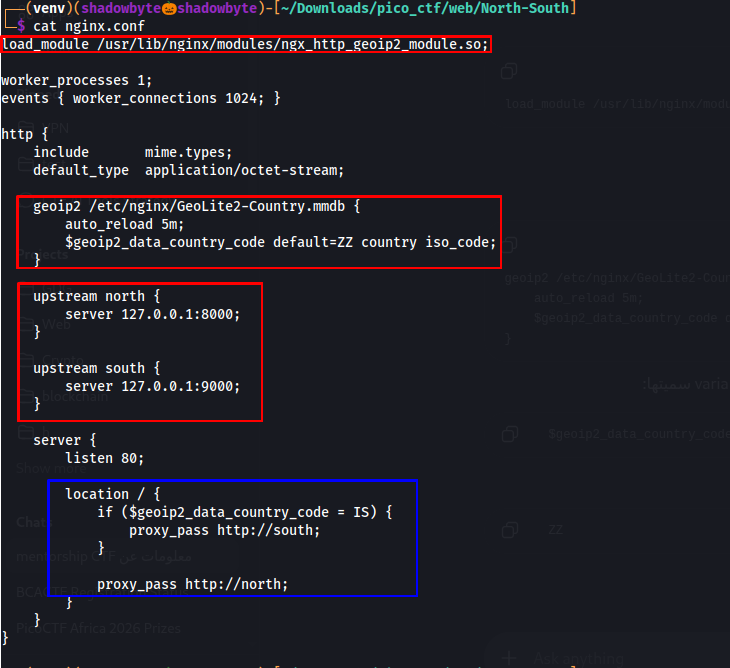
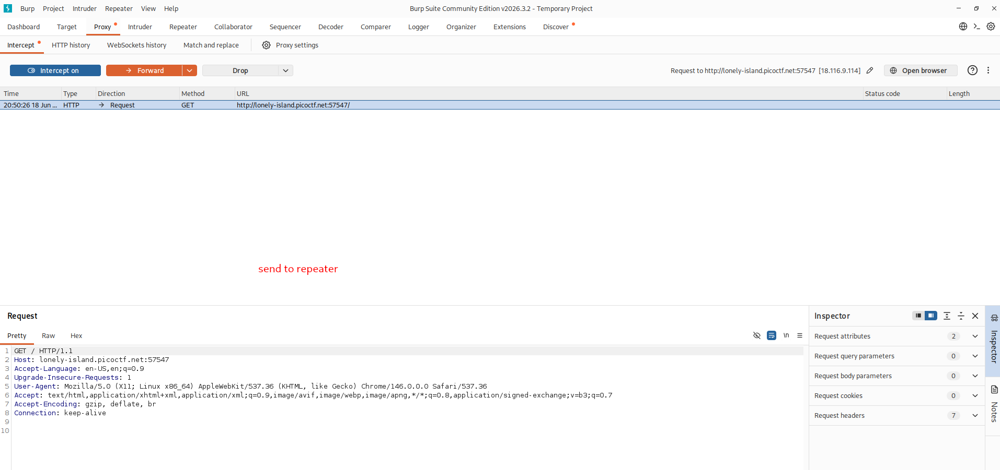
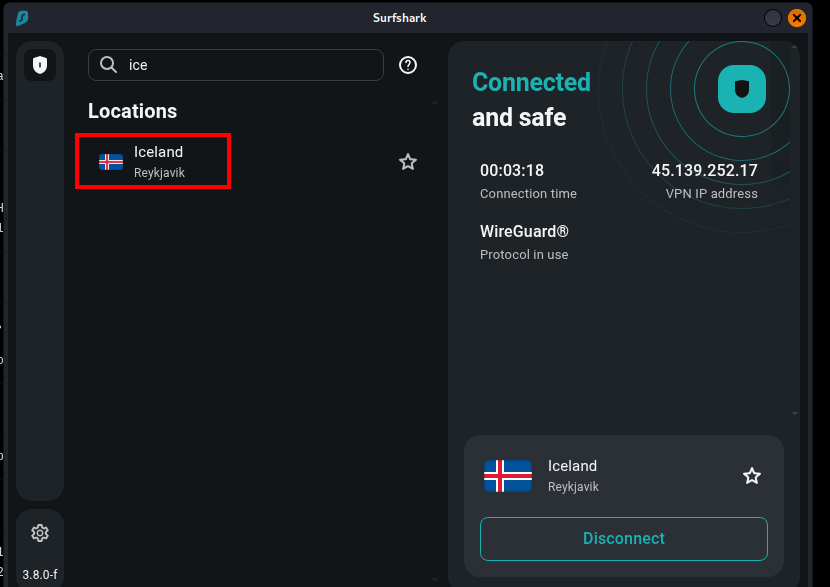

# North-South

**Category:** Web Exploitation
**Difficulty:** Medium
**Author:** Darkraicg492

---

## Challenge Description

The challenge describes a web application protected by geo-based routing.

Only requests coming from a specific geographic region are routed to the real backend containing the flag. Requests from other regions are routed to a different backend that does not contain the flag.

The goal is to understand how the routing works and access the correct region-restricted backend.

---

## Source Code Review

The provided source included an Nginx configuration file.

The first important line loads the GeoIP2 module:

```nginx
load_module /usr/lib/nginx/modules/ngx_http_geoip2_module.so;
```

The configuration then loads a GeoLite2 country database:

```nginx
geoip2 /etc/nginx/GeoLite2-Country.mmdb {
    auto_reload 5m;
    $geoip2_data_country_code default=ZZ country iso_code;
}
```

This means Nginx determines the visitor’s country code and stores it in:

```text
$geoip2_data_country_code
```



---

## Routing Logic

The configuration defines two backend services:

```nginx
upstream north {
    server 127.0.0.1:8000;
}

upstream south {
    server 127.0.0.1:9000;
}
```

The most important part is the routing rule:

```nginx
location / {
    if ($geoip2_data_country_code = IS) {
        proxy_pass http://south;
    }

    proxy_pass http://north;
}
```

This means:

```text
If country code = IS  → route to south backend
Otherwise             → route to north backend
```

The country code `IS` corresponds to Iceland.

Therefore, the flag should be reachable only when the request appears to come from Iceland.

---

## Initial Request

I first accessed the challenge normally:

```text
http://lonely-island.picoctf.net:<PORT>/
```

Using Burp Suite, I captured the request:

```http
GET / HTTP/1.1
Host: lonely-island.picoctf.net:<PORT>
```



When accessing the page from my normal network location, the application returned the non-flag backend.

The response was similar to:

```html
<h1>Welcome!!</h1>
<p>No flag in this region!</p>
```

This confirmed that I was being routed to the wrong region.

---

## Failed Header Spoofing Attempts

Since many applications rely on proxy headers to determine the client IP, I tested several common headers in Burp Repeater, including:

```http
X-Forwarded-For: <Iceland_IP>
X-Real-IP: <Iceland_IP>
CF-Connecting-IP: <Iceland_IP>
CF-IPCountry: IS
```

However, these did not reveal the flag.

This made sense after reviewing the Nginx configuration: there was no `real_ip_header` directive configured. Therefore, Nginx was using the real source IP of the connection for GeoIP lookup, not client-controlled headers.

So the correct approach was not header spoofing, but actually making the request originate from Iceland.

---

## Bypassing the Geo Restriction

To make my traffic appear to come from Iceland, I connected to an Iceland VPN endpoint.



After connecting to the Iceland VPN, my public IP was located in Iceland. This caused the GeoIP2 module to assign the country code:

```text
IS
```

As a result, the Nginx rule routed my request to the `south` backend.

---

## Retrieving the Flag

After refreshing the challenge page while connected to the Iceland VPN, the page returned the flag.


The page displayed:

```text
picoCTF{...REDACTED...}
```

---

## Why the Exploit Works

The application relies on GeoIP-based routing at the Nginx layer.

The configuration routes requests based on the visitor’s country code:

```text
IS → south backend
Other countries → north backend
```

The `south` backend contains the flag, while the `north` backend returns a decoy response.

Since the routing decision is based on the real source IP address, spoofing HTTP headers was not enough. The request had to actually come from an IP address geolocated to Iceland.

Using an Iceland VPN satisfied the routing condition and allowed access to the backend containing the flag.

---

## Attack Flow

```text
Review Nginx configuration
    ↓
Find GeoIP2 country-based routing
    ↓
Identify IS as the required country code
    ↓
Confirm normal access returns "No flag in this region"
    ↓
Try common IP spoofing headers
    ↓
Observe that header spoofing does not work
    ↓
Connect to Iceland VPN
    ↓
Reload the challenge page
    ↓
Request is routed to the south backend
    ↓
Retrieve the flag
```

---

## Tools Used

```text
Browser
Burp Suite
Nginx configuration review
VPN
Linux terminal
```

---

## Key Takeaways

* GeoIP restrictions can be enforced at the reverse proxy layer.
* The country code `IS` represents Iceland.
* HTTP headers such as `X-Forwarded-For` only work if the proxy is configured to trust them.
* If Nginx uses the real source IP for GeoIP lookup, header spoofing will not bypass the restriction.
* A VPN or proxy from the allowed country can satisfy the GeoIP routing condition.
* Reviewing configuration files can reveal the exact routing logic behind a challenge.

---

## Final Flag

```text
picoCTF{...REDACTED...}
```
