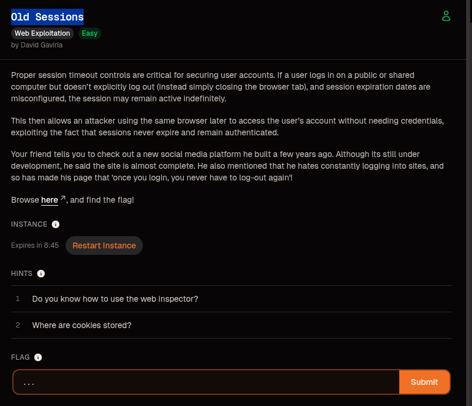
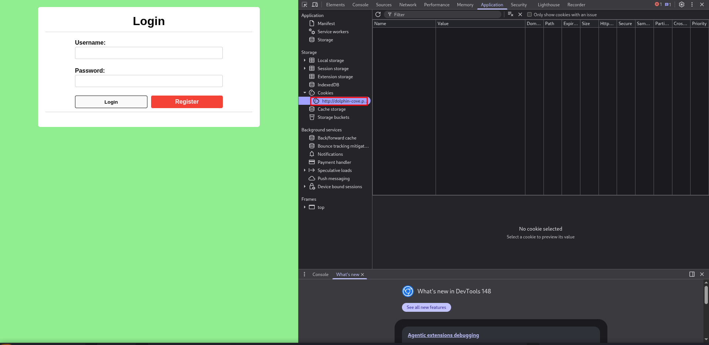
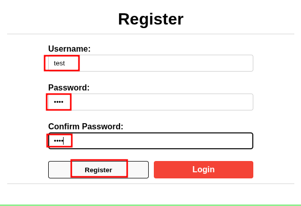
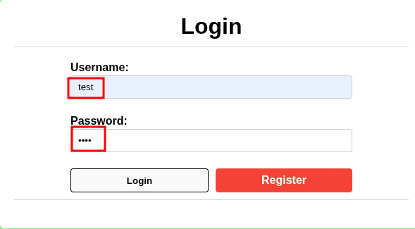
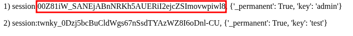
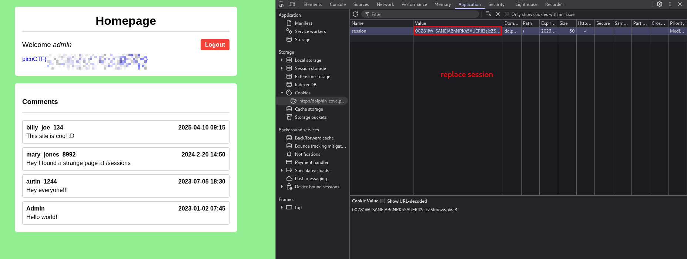

# Old Sessions

**Category:** Web Exploitation  
**Difficulty:** Easy  
**Author:** David Gaviria  

---

## Challenge Description

The challenge talks about improper session timeout controls.

If a user logs in on a public or shared computer and simply closes the browser tab without logging out, a misconfigured session expiration policy can leave the account authenticated for a long time.

The challenge description also mentions:

> once you login, you never have to log-out again

This is a strong hint that the application uses persistent sessions or cookies that do not expire properly.

The goal is to inspect how the application stores sessions and find a way to access the flag.



---

## Initial Page

After opening the challenge website, I found a simple login page.



Before logging in, I opened the browser developer tools:

```text
Inspect → Application → Cookies
```

At this point, there were no cookies stored for the website.

This confirms that the application creates the session cookie only after authentication.

---

## Creating a Test Account

Since I did not have valid credentials, I created a normal test account.

I used:

```text
Username: test
Password: test
```



After registering, I logged in using the same credentials.



---

## Inspecting the Session Cookie

After logging in, I was redirected to the homepage.

The page displayed:

```text
Welcome test
```

I checked the cookies again in the browser developer tools.


A new cookie appeared:

```text
Name: session
```

The cookie had a long expiration date, which matches the challenge idea about old sessions staying valid for too long.

On the homepage, there was also an important comment:

```text
mary_jones_8992
Hey I found a strange page at /sessions
```

This comment leaks a hidden endpoint:

```text
/sessions
```

---

## Visiting the Hidden `/sessions` Endpoint

I visited:

```text
/sessions
```

The page displayed stored session values.



There were two sessions:

```text
1) session:00Z8iW_SANEjABnNRKh5AUERiI2ejcZSlmovwpiwl8, {'_permanent': True, 'key': 'admin'}

2) session:twnky_0Dzj5bcBuCldWgs67nSsdTYAzWZ8I6oDnl-CU, {'_permanent': True, 'key': 'test'}
```

The second session belongs to my `test` account.

The first session belongs to:

```text
admin
```

This means the `/sessions` endpoint leaks valid active session tokens.

---

## Exploiting the Session Leak

The vulnerability is simple:

1. The application stores authentication state inside a session cookie.
2. The `/sessions` endpoint leaks old session values.
3. The admin session is still valid.
4. Replacing my cookie with the leaked admin session authenticates me as admin.

I went back to:

```text
DevTools → Application → Cookies
```

Then I replaced my current `session` cookie value with the leaked admin session value:

```text
00Z8iW_SANEjABnNRKh5AUERiI2ejcZSlmovwpiwl8
```

I did not change the cookie name. I only changed the value.

```text
Name:  session
Value: 00Z8iW_SANEjABnNRKh5AUERiI2ejcZSlmovwpiwl8
```

After refreshing the homepage, the website authenticated me as admin.



The page displayed:

```text
Welcome admin
```

and the flag appeared on the page.

---

## Flag

For the public writeup, I am redacting the flag:

```text
picoCTF{...PWNED...}
```

---

## Vulnerability Explanation

The issue is an **old session reuse vulnerability**.

The application keeps sessions permanently active:

```text
'_permanent': True
```

It also exposes stored session values through the `/sessions` endpoint.

Because the admin session is still valid, an attacker can copy the leaked admin session token and replace their own session cookie with it.

This results in an admin session takeover.

---

## Key Takeaways

- Browser developer tools can be used to inspect cookies.
- Authentication sessions are often stored inside cookies.
- A session cookie should never be exposed publicly.
- Old sessions should expire after a reasonable timeout.
- Sensitive endpoints like `/sessions` should not be accessible to normal users.
- Reusing a leaked admin session allows account takeover.

---

## Summary

The challenge hinted at session cookies and improper expiration.

After creating a test account, I inspected the session cookie and found a comment pointing to `/sessions`.

The `/sessions` endpoint leaked both my test session and an old admin session.

By replacing my current session cookie with the leaked admin session value, I became authenticated as admin and obtained the flag.

```text
test account
    → inspect cookies
        → find /sessions
            → leak admin session
                → replace session cookie
                    → Welcome admin
                        → picoCTF{...PWNED...}
```
